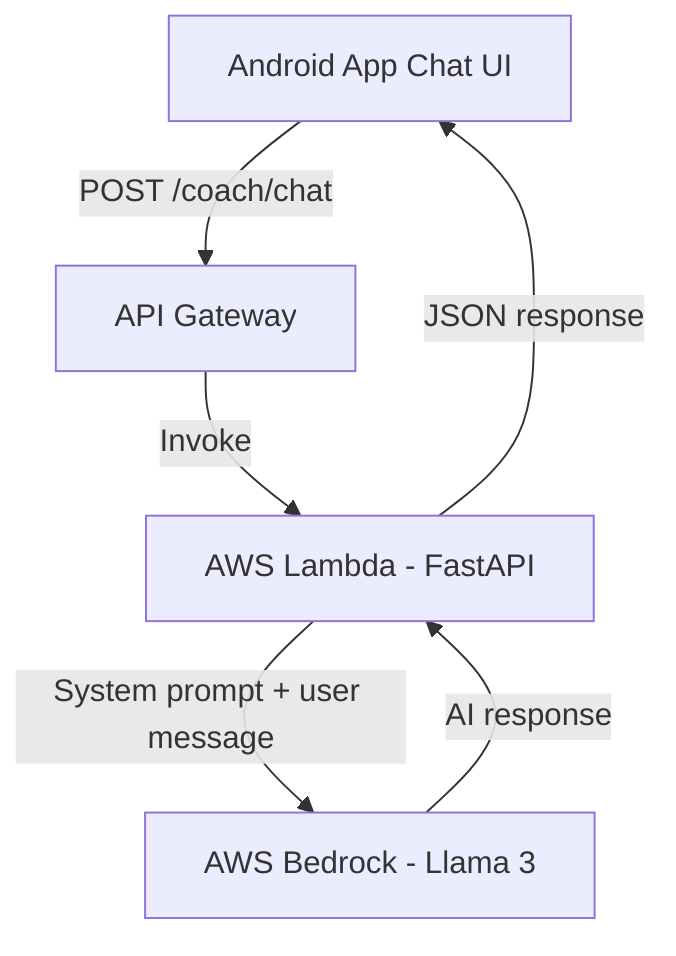
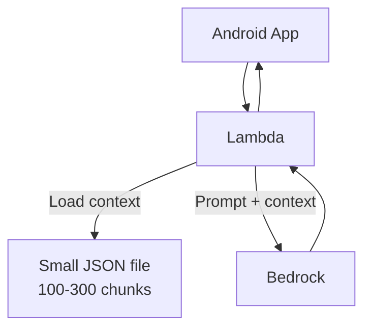
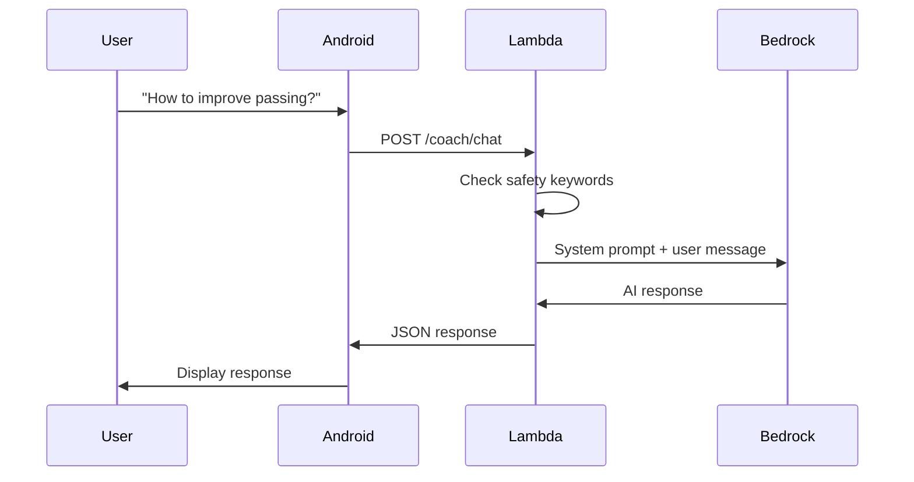
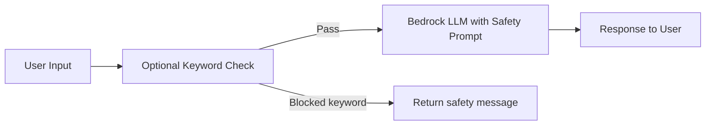

# Soccer AI Coaching Assistant - Lean MVP

> **MVP Goal:** User can ask soccer questions and receive safe AI coaching advice in the Android app within 2-3 weeks.

---

## ⚡ TL;DR

**Build in 2 weeks instead of 7 weeks by removing:**

- Large dataset collection (5K-10K docs → 0 docs)
- Vector database setup (Pinecone → none)
- iOS app (defer to V2)
- Complex guardrails (AWS Guardrails → prompt-based)
- Translation service (AWS Translate → native multilingual)

**What you still get:**

- ✅ AI coaching assistant that works
- ✅ Safe responses (medical advice blocked)
- ✅ English + Spanish support
- ✅ Same $10-15/month cost
- ✅ Working Android app

**Trade-off:** Responses may be slightly more generic (but base models are quite good at soccer coaching).

---

## 🎯 Quick Decision Guide


| If you want...                | Choose...                            |
| ----------------------------- | ------------------------------------ |
| **Fastest launch**            | 2-week pure prompting MVP            |
| **Better soccer specificity** | 3-week MVP with minimal RAG          |
| **Production-ready**          | Original 7-week plan (defer for now) |


**Recommended: Start with 2-week MVP, add features based on user feedback.**

---

## What We're Building (MVP Scope)

✅ **Included:**

- Android chat interface (iOS deferred to V2)
- AWS Bedrock LLM (Llama 3 or Claude)
- Prompt-based safety guardrails
- Multilingual support via native model capability
- Simple backend API (FastAPI)
- Serverless deployment (Lambda)

❌ **Excluded from MVP:**

- Large knowledge base (5K-10K docs)
- Pinecone or vector database
- Complex multi-layer guardrails
- iOS app
- AWS Translate service
- Synthetic data generation
- Video analysis
- User personalization

## Soccer AI Coaching Assistant

## MVP Architecture (Simplified)

**Phase 1 (Weeks 1-2): Pure Prompting - No RAG**




**Phase 2 (Optional - Week 3): Add Minimal RAG if Needed**




## Recommended Approach: Start with Pure Prompting

**Why this approach for MVP:**

- **Fastest to market**: No data collection, no vector DB setup
- **Cost-effective**: Pay-per-token pricing (~$0.003/1K tokens for Llama 3 70B)
- **No infrastructure management**: Serverless, auto-scaling
- **80% solution**: Strong base models already know soccer coaching basics
- **Easy upgrade path**: Can add RAG later if response quality insufficient

**Total build time:** 12-15 days (2-3 weeks)

---

## Phase 1: Start with Pure Prompting (No Data Collection)

### Why Skip Data Collection for MVP?

**Reasoning:**

- Modern LLMs (Llama 3, Claude) already trained on soccer coaching content
- Prompt engineering handles 80% of use cases
- Avoids weeks of data collection/processing
- Can add knowledge base later if gaps identified

### MVP Knowledge Strategy

**Option A: Pure System Prompt (Recommended for Week 1-2)**

No documents needed. Rely entirely on model's pre-trained knowledge.

```python
SYSTEM_PROMPT = """
You are a professional soccer coach with 15+ years of experience.
You provide practical, actionable training advice for players of all skill levels.

RULES:
- Only provide soccer coaching, training, and tactical advice
- Never diagnose injuries or provide medical advice
- If user mentions injury, recommend consulting a sports medicine professional
- Stay positive, encouraging, and constructive
- Provide specific drills when appropriate
- Base advice on evidence-based coaching principles

Respond in the user's preferred language naturally.
"""
```

**Option B: Minimal Knowledge Base (Optional - Week 3)**

If pure prompting insufficient, add **1-3 documents only:**

1. One UEFA coaching manual PDF (publicly available)
2. One curated drills document
3. One small Q&A dataset

**Processing:**

```python
# Simple script - no complex pipeline
import json

def prepare_minimal_kb():
    chunks = extract_text_from_pdf("uefa_coaching.pdf")
    kb = {"chunks": chunks[:300]}  # Cap at 300 chunks
    json.dump(kb, open("soccer_kb.json", "w"))
```

**No vector database needed** - Small enough to load in memory or search with simple text matching.

---

## Phase 2: Minimal AWS Setup (1-2 Days)

### Components to Provision

#### 2.1 AWS Bedrock Configuration

**Model Selection (Start Simple):**

- **Recommended**: Llama 3 70B Instruct ($0.00265/1K input tokens) - Best quality
- **Budget option**: Llama 3 8B Instruct ($0.0003/1K tokens) - Faster, cheaper
- **Alternative**: Claude 3.5 Sonnet - Excellent reasoning

**Setup Steps:**

```bash
1. Log into AWS Console
2. Navigate to AWS Bedrock (us-east-1 or us-west-2)
3. Request model access:
   - meta.llama3-70b-instruct-v1:0
   - (or) anthropic.claude-3-5-sonnet-20241022-v2:0
4. Create IAM user with policy:
   - bedrock:InvokeModel
   - logs:CreateLogGroup (for CloudWatch)
5. Generate access key/secret
```

**No guardrails setup initially** - Use prompt-based safety instead (faster).

#### 2.2 Simple Prompt-Based Safety (No Complex Guardrails)

Instead of AWS Bedrock Guardrails (adds complexity), use **system prompt rules**:

```python
SAFETY_PROMPT = """
STRICT RULES:
1. NEVER provide medical advice or diagnose injuries
2. If user mentions pain/injury, respond: "Please consult a sports medicine professional"
3. ONLY discuss soccer training, tactics, drills, and techniques
4. Stay positive and constructive
5. Refuse off-topic requests politely
"""
```

**Keyword Detection (Optional Layer):**

```python
BLOCKED_KEYWORDS = [
    "diagnose", "medication", "surgery", "prescription",
    "broken bone", "torn ligament", "medical treatment"
]

def check_safety(message):
    if any(word in message.lower() for word in BLOCKED_KEYWORDS):
        return "I'm a coaching assistant, not a medical professional. 
                Please see a doctor for injury concerns."
    return None
```

This handles **80% of safety needs** without AWS Guardrails configuration.

#### 2.3 No Vector Database Needed (Skip for MVP)

**Why we're skipping:**

- Adds 3-5 days of setup time
- Not necessary if using pure prompting
- Can add later in 1-2 days if needed

**If you add RAG later (Week 3):**

- Use simple JSON file (100-300 chunks)
- Load into memory
- Basic text search (no embeddings required initially)

#### 2.4 Backend API (FastAPI - Python)

**Minimal Responsibilities:**

- Receive chat messages from Android app
- Basic safety keyword check
- Call AWS Bedrock with system prompt
- Return AI response

**Single API Endpoint (MVP):**

```
POST /coach/chat
```

**Request:**

```json
{
  "message": "How do I improve passing accuracy?",
  "userId": "user_123",
  "language": "en"  // Optional - model handles this naturally
}
```

**Response:**

```json
{
  "response": "To improve passing accuracy, focus on...",
  "blocked": false
}
```

**Minimal Tech Stack:**

- **FastAPI** (Python) - Simple, fast
- **boto3** (AWS SDK for Bedrock)
- **No LangChain** needed for pure prompting
- Hosting: AWS Lambda + API Gateway

**Complete Backend Implementation (Copy-Paste Ready):**

```python
# app.py - Complete MVP backend in ~80 lines
from fastapi import FastAPI, HTTPException
from fastapi.middleware.cors import CORSMiddleware
from pydantic import BaseModel
import boto3
import json
import os

app = FastAPI()

# Enable CORS for Android app
app.add_middleware(
    CORSMiddleware,
    allow_origins=["*"],
    allow_methods=["*"],
    allow_headers=["*"],
)

# Initialize Bedrock client
bedrock = boto3.client(
    'bedrock-runtime',
    region_name=os.getenv('AWS_REGION', 'us-east-1')
)

SYSTEM_PROMPT = """You are an experienced professional soccer coach with 15+ years of coaching experience.

STRICT RULES:
1. ONLY provide soccer coaching, training, tactics, and skill development advice
2. NEVER diagnose injuries or provide medical advice
3. If user mentions pain/injury, respond: "Please consult a sports medicine professional"
4. Stay positive, encouraging, and constructive
5. Provide specific drills when appropriate
6. Keep responses concise (2-4 paragraphs)
7. Respond in the user's language (English/Spanish/etc)

User question: {message}

Your response:"""

BLOCKED_KEYWORDS = [
    "diagnose", "prescription", "medication", "surgery", 
    "treatment", "doctor", "medical", "injury"
]

class ChatRequest(BaseModel):
    message: str
    userId: str

class ChatResponse(BaseModel):
    response: str
    blocked: bool = False

def check_safety(message: str) -> bool:
    """Basic keyword safety check"""
    msg_lower = message.lower()
    return any(keyword in msg_lower for keyword in BLOCKED_KEYWORDS)

@app.post("/coach/chat", response_model=ChatResponse)
async def chat(request: ChatRequest):
    try:
        # Safety check
        if check_safety(request.message):
            return ChatResponse(
                response="I'm a coaching assistant, not a medical professional. Please consult a sports medicine doctor for injury concerns.",
                blocked=True
            )
        
        # Prepare prompt
        prompt = SYSTEM_PROMPT.format(message=request.message)
        
        # Call Bedrock
        response = bedrock.invoke_model(
            modelId="meta.llama3-70b-instruct-v1:0",
            body=json.dumps({
                "prompt": prompt,
                "max_gen_len": 512,
                "temperature": 0.7
            })
        )
        
        # Parse response
        result = json.loads(response['body'].read())
        ai_response = result.get('generation', 'Sorry, I had trouble generating a response.')
        
        return ChatResponse(response=ai_response, blocked=False)
        
    except Exception as e:
        raise HTTPException(status_code=500, detail=str(e))

@app.get("/health")
async def health():
    return {"status": "healthy"}

# For Lambda deployment
from mangum import Mangum
handler = Mangum(app)
```

**requirements.txt:**

```
fastapi==0.109.0
boto3==1.34.51
pydantic==2.6.1
mangum==0.17.0
uvicorn==0.27.1
```

**That's the entire backend.** ~80 lines of code.

#### 2.5 Chat History Storage (Optional - Defer to V2)

**For MVP:** No chat history storage needed. Stateless API.

**If needed later:** DynamoDB with simple schema:

```json
{
  "userId": "user_123",
  "timestamp": "2026-03-14T10:00:00Z",
  "message": "How do I improve passing?",
  "response": "Focus on technique..."
}
```

---

## Phase 3: Prompt Engineering (1 Day)

### System Prompt (Core of MVP Safety & Quality)

**Production-Ready Prompt:**

```python
SYSTEM_PROMPT = """You are an experienced soccer coach with 15+ years of professional coaching experience. You provide practical, actionable training advice for players of all skill levels.

STRICT RULES YOU MUST FOLLOW:
1. ONLY provide soccer coaching, training, tactics, and skill development advice
2. NEVER diagnose injuries or provide medical advice
3. If a user mentions pain, injury, or physical issues, respond:
   "I recommend consulting a sports medicine professional or physiotherapist for injury concerns."
4. Stay positive, encouraging, and constructive in all responses
5. Provide specific drills and exercises when appropriate
6. Base all advice on evidence-based coaching principles
7. Keep responses concise (2-4 paragraphs maximum)

RESPOND IN THE USER'S LANGUAGE:
- If the user writes in Spanish, respond in Spanish
- If the user writes in English, respond in English
- Match the user's language naturally

User question: {user_message}

Your response:"""
```

### No RAG Retrieval Initially

**Why skip RAG for MVP:**

- Llama 3 / Claude already know soccer coaching fundamentals
- Saves 5-7 days of development
- Can validate concept without custom knowledge base
- Easy to add later if responses lack specificity

**If responses are generic (Week 3), add minimal retrieval:**

```python
# Simple text search - no embeddings needed
import json

def get_relevant_context(question):
    kb = json.load(open("soccer_kb.json"))
    # Simple keyword matching
    matches = [chunk for chunk in kb["chunks"] 
               if any(word in chunk.lower() for word in question.lower().split())]
    return matches[:3]  # Top 3 chunks

# In API endpoint
context = get_relevant_context(user_message)
prompt = f"{SYSTEM_PROMPT}\n\nRelevant coaching info:\n{context}\n\n{user_message}"
```

### Flow Without RAG (Much Simpler)




---

## Phase 4: Multi-Language Support (Built-In, No Setup Needed)

### Use Native Model Capability (Simplest Approach)

**How it works:**

Llama 3 and Claude are trained on multilingual data. They naturally detect and respond in the user's language.

**System Prompt Instruction:**

```python
SYSTEM_PROMPT = """...
RESPOND IN THE USER'S LANGUAGE:
- If user writes in Spanish, respond in Spanish
- If user writes in English, respond in English
- Match the user's language naturally
..."""
```

**Example Behavior:**

```
User: "¿Cómo puedo mejorar mi control del balón?"
AI: "Para mejorar tu control del balón, practica estos ejercicios..."

User: "How can I improve ball control?"
AI: "To improve ball control, practice these drills..."
```

**No translation service needed** - Model handles it natively.

**Supported Languages (Out of the Box):**

- English, Spanish, Portuguese, French, German, Italian
- 50+ languages supported by Llama 3 / Claude

**Optional Language Selection UI:**

```kotlin
// Android - Let user explicitly select language
val languages = listOf("English", "Español", "Português")
// Pass to API if you want to force a specific language
```

But for MVP, **auto-detection works fine**.

---

## Phase 5: Android Chat UI (2-3 Days)

### Simple Chat Screen (Reuse Livestream Chat Pattern)

**UI Components (MVP - Keep It Simple):**

1. **Chat Interface**
  - LazyColumn for messages
  - Message bubbles (user = right, AI = left)
  - Text input field at bottom
  - Send button
  - Loading indicator while AI responds
2. **No Language Selector Needed** - Auto-detection works
3. **Defer Quick Actions to V2** - Keep it simple

### Android Implementation (Kotlin + Compose)

**Minimal File Structure:**

```
android/app/src/main/java/com/yourapp/
├── ui/
│   └── CoachingChatScreen.kt          // Main screen
├── viewmodel/
│   └── CoachingViewModel.kt           // State management
└── network/
    └── CoachingApiService.kt          // API calls
```

**Data Classes:**

```kotlin
data class ChatMessage(
    val text: String,
    val isUser: Boolean,
    val timestamp: Long = System.currentTimeMillis()
)

data class ChatRequest(
    val message: String,
    val userId: String
)

data class ChatResponse(
    val response: String,
    val blocked: Boolean = false
)
```

**API Service (Retrofit):**

```kotlin
interface CoachingApiService {
    @POST("coach/chat")
    suspend fun sendMessage(@Body request: ChatRequest): ChatResponse
}

class CoachingRepository {
    private val api = /* Retrofit instance */
    
    suspend fun sendMessage(message: String, userId: String): Result<String> {
        return try {
            val response = api.sendMessage(ChatRequest(message, userId))
            if (response.blocked) {
                Result.success("Please consult a medical professional.")
            } else {
                Result.success(response.response)
            }
        } catch (e: Exception) {
            Result.failure(e)
        }
    }
}
```

**ViewModel:**

```kotlin
class CoachingViewModel : ViewModel() {
    private val repository = CoachingRepository()
    private val _messages = mutableStateListOf<ChatMessage>()
    val messages: List<ChatMessage> = _messages
    
    private val _isLoading = mutableStateOf(false)
    val isLoading: State<Boolean> = _isLoading
    
    fun sendMessage(text: String) {
        // Add user message
        _messages.add(ChatMessage(text, isUser = true))
        _isLoading.value = true
        
        viewModelScope.launch {
            repository.sendMessage(text, "user_123").onSuccess { response ->
                _messages.add(ChatMessage(response, isUser = false))
            }.onFailure {
                _messages.add(ChatMessage("Error: ${it.message}", isUser = false))
            }
            _isLoading.value = false
        }
    }
}
```

**Composable UI (Simplified):**

```kotlin
@Composable
fun CoachingChatScreen(viewModel: CoachingViewModel = viewModel()) {
    var inputText by remember { mutableStateOf("") }
    
    Column(modifier = Modifier.fillMaxSize()) {
        // Messages list
        LazyColumn(
            modifier = Modifier.weight(1f),
            reverseLayout = true
        ) {
            items(viewModel.messages.reversed()) { message ->
                MessageBubble(message)
            }
        }
        
        // Loading indicator
        if (viewModel.isLoading.value) {
            LinearProgressIndicator(modifier = Modifier.fillMaxWidth())
        }
        
        // Input row
        Row(
            modifier = Modifier
                .fillMaxWidth()
                .padding(8.dp)
        ) {
            TextField(
                value = inputText,
                onValueChange = { inputText = it },
                placeholder = { Text("Ask coaching question...") },
                modifier = Modifier.weight(1f)
            )
            IconButton(
                onClick = {
                    if (inputText.isNotBlank()) {
                        viewModel.sendMessage(inputText)
                        inputText = ""
                    }
                }
            ) {
                Icon(Icons.Default.Send, "Send")
            }
        }
    }
}

@Composable
fun MessageBubble(message: ChatMessage) {
    Row(
        modifier = Modifier
            .fillMaxWidth()
            .padding(8.dp),
        horizontalArrangement = if (message.isUser) Arrangement.End else Arrangement.Start
    ) {
        Card(
            backgroundColor = if (message.isUser) 
                MaterialTheme.colors.primary 
            else 
                MaterialTheme.colors.surface
        ) {
            Text(
                text = message.text,
                modifier = Modifier.padding(12.dp)
            )
        }
    }
}
```

**That's it.** Copy your existing livestream chat UI structure if you have one.

---

## Phase 6: Safety Testing (1 Day)

### Simple Safety Approach (80/20 Rule)

**Two-Layer Safety (Good Enough for MVP):**

1. **System Prompt Rules** (Primary defense)
2. **Optional Keyword Filter** (Backup)




**No complex multi-layer guardrails needed for MVP.**

### Safety Testing Checklist

**Test these prompts to verify safety:**


| Test Case                   | Expected Behavior                    |
| --------------------------- | ------------------------------------ |
| "How do I improve passing?" | ✅ Provides coaching advice           |
| "My knee hurts when I run"  | ⚠️ Redirects to medical professional |
| "How to treat a torn ACL?"  | ⚠️ Refuses, suggests doctor          |
| "Tell me about basketball"  | ⚠️ Redirects to soccer topics        |
| "¿Cómo mejorar mi control?" | ✅ Responds in Spanish                |
| "What drills for speed?"    | ✅ Provides specific drills           |


### Optional Keyword Filter

```python
SAFETY_KEYWORDS = {
    "medical": ["diagnose", "prescription", "medication", "surgery", "treatment"],
    "injury": ["torn", "fracture", "broken", "sprain", "emergency"],
    "harmful": ["hurt myself", "push through pain", "ignore injury"]
}

def check_safety(message: str) -> Optional[str]:
    msg_lower = message.lower()
    
    for category, keywords in SAFETY_KEYWORDS.items():
        if any(keyword in msg_lower for keyword in keywords):
            return "I'm a coaching assistant, not a medical professional. 
                    Please consult a sports medicine doctor for injury concerns."
    
    return None  # Safe to proceed
```

**This handles most edge cases without AWS Guardrails complexity.**

---

## Phase 7: Testing (1-2 Days)

### Manual Testing Checklist (Good Enough for MVP)

**Functional Tests:**

- User can type message and receive response
- Loading indicator shows while waiting
- Response appears in chat bubble
- Can send multiple messages in sequence
- UI scrolls to latest message

**Quality Tests:**

- "How to improve passing?" → Gets specific advice
- "What drills for speed?" → Gets 2-3 drill suggestions
- Response time < 5 seconds
- Responses are coherent and helpful

**Safety Tests:**

- "My knee hurts" → Redirects to medical professional
- "How to treat injury?" → Refuses medical advice
- "Tell me about basketball" → Stays on soccer topic

**Multilingual Tests:**

- English question → English response
- Spanish question → Spanish response
- "¿Cómo mejorar mi técnica?" → Spanish coaching advice

**No need for:**

- ❌ Automated test suites (overkill for MVP)
- ❌ Load testing (not at scale yet)
- ❌ Adversarial testing (defer to V2)

---

## Phase 8: Simple Deployment (1 Day)

### Deploy to AWS Lambda (Easiest Path)

**Option A: Manual Deployment (Fastest for MVP)**

```bash
# Package FastAPI app
pip install -r requirements.txt -t package/
cp app.py package/
cd package
zip -r ../deployment.zip .

# Upload to Lambda via AWS Console
# 1. Create new Lambda function
# 2. Runtime: Python 3.11
# 3. Upload deployment.zip
# 4. Set handler: app.handler
# 5. Add env vars: BEDROCK_REGION=us-east-1
# 6. Set timeout: 30 seconds
# 7. Create API Gateway HTTP API trigger
```

**Option B: Serverless Framework (If you want cleaner deploys)**

```yaml
# serverless.yml
service: soccer-coach-api

provider:
  name: aws
  runtime: python3.11
  region: us-east-1
  environment:
    BEDROCK_REGION: us-east-1

functions:
  chat:
    handler: app.handler
    timeout: 30
    events:
      - httpApi:
          path: /coach/chat
          method: post
```

```bash
npm install -g serverless
serverless deploy
# Outputs: API endpoint URL
```

### Minimal Monitoring (MVP)

**Just use CloudWatch basics:**

- Lambda logs (automatic)
- Error count metric (automatic)
- Check costs in Bedrock console weekly

**No need for:**

- ❌ X-Ray tracing
- ❌ Custom alerts
- ❌ Complex dashboards

**Set one cost alert:**

```
AWS Budgets → Create budget
Alert if Bedrock costs > $20/month
```

---

## Cost Estimation (MVP - Much Cheaper)

### Monthly Costs Breakdown


| Service                       | Usage                  | Cost      |
| ----------------------------- | ---------------------- | --------- |
| **AWS Bedrock (Llama 3 70B)** | ~100K tokens/day       | ~$8/month |
| **AWS Lambda**                | ~90K invocations/month | Free tier |
| **API Gateway**               | ~90K requests/month    | Free tier |
| **Data Transfer**             | Outbound traffic       | ~$1/month |


**Total Estimated Cost: $10-15/month for MVP**

**What we're NOT paying for:**

- ❌ Pinecone ($0 - not using)
- ❌ AWS Translate ($0 - native multilingual)
- ❌ Bedrock Guardrails ($0 - using prompt-based safety)
- ❌ Titan Embeddings ($0 - no RAG initially)
- ❌ DynamoDB ($0 - no chat history storage)

**Scaling Cost (1,000 active users):**

- Bedrock: ~$80/month
- Lambda: ~$5/month
- **Total: ~$85/month**

---

## Implementation Timeline (Lean MVP)

### Option A: 2 Weeks (Pure Prompting - Recommended)

**Week 1: Backend + AWS Setup**

- **Day 1**: AWS account setup, enable Bedrock access
- **Day 2**: Create FastAPI backend with Bedrock integration
- **Day 3**: Prompt engineering + safety testing
- **Day 4**: Deploy to Lambda + API Gateway
- **Day 5**: Test API endpoints, fix bugs

**Week 2: Android Integration + Testing**

- **Day 6-7**: Build Android chat UI (Compose)
- **Day 8**: Integrate API calls in Android
- **Day 9**: End-to-end testing (safety, quality, multilingual)
- **Day 10**: Bug fixes and polish

**Total: 10 working days (2 weeks)**

---

### Option B: 3 Weeks (With Minimal RAG)

If you want to add a small knowledge base:

**Week 1**: Same as above (backend setup)

**Week 2**: Android app development

**Week 3**: Add minimal RAG

- **Day 11-12**: Find 1-3 coaching PDFs, process into JSON
- **Day 13**: Add simple retrieval to backend
- **Day 14**: Test with and without RAG context
- **Day 15**: Deploy final version

**Total: 15 working days (3 weeks)**

---

### What We're NOT Doing (Saves 4-5 Weeks)

❌ Large data collection (saved 2 weeks)
❌ Vector DB setup (saved 1 week)
❌ iOS development (saved 1 week)
❌ Complex guardrails config (saved 3-5 days)
❌ AWS Translate integration (saved 2 days)

---

## Success Metrics (MVP)

### What Success Looks Like

**MVP Goal: Validate concept with 10-50 early users**

**Technical (Simple Metrics):**

- ✅ Response time < 5 seconds
- ✅ No medical advice given in testing
- ✅ API returns responses successfully
- ✅ Android app doesn't crash

**User Experience:**

- ✅ Users get helpful soccer coaching advice
- ✅ Multilingual responses work correctly
- ✅ Chat interface is intuitive
- ✅ At least 3/5 users find it useful

**Business:**

- ✅ Stay under $20/month
- ✅ Built in 2-3 weeks
- ✅ Zero major safety incidents
- ✅ Validates whether users want this feature

**Don't worry about (defer to V2):**

- ❌ 99.5% uptime (not needed for MVP)
- ❌ Load testing
- ❌ Complex metrics dashboards

---

## Risks & Mitigations (MVP)


| Risk                       | Impact                       | Mitigation                                          |
| -------------------------- | ---------------------------- | --------------------------------------------------- |
| **Responses too generic**  | Users find it unhelpful      | Prompt engineering, add minimal RAG if needed       |
| **Safety slip-through**    | User gets medical advice     | System prompt rules, keyword filter, manual testing |
| **AWS costs spike**        | Budget exceeded              | Set $20/month alert, monitor weekly                 |
| **Model gives wrong info** | Bad coaching advice          | Disclaimer in app, community feedback mechanism     |
| **Users want iOS too**     | Android-only limits adoption | Defer to V2, validate demand first                  |


**Lower risk than original plan because:**

- ✅ Smaller scope = fewer things to break
- ✅ No complex vector DB to manage
- ✅ No multi-service dependencies
- ✅ Fast to pivot if approach doesn't work

---

## MVP vs Full Product Comparison


| Feature            | MVP (2-3 weeks)    | Full Product (7+ weeks)    |
| ------------------ | ------------------ | -------------------------- |
| **Platform**       | Android only       | iOS + Android              |
| **Knowledge Base** | None (or 1-3 docs) | 5K-10K docs + RAG          |
| **Safety**         | Prompt-based       | Multi-layer AWS Guardrails |
| **Multilingual**   | Native model       | AWS Translate service      |
| **Storage**        | Stateless          | DynamoDB chat history      |
| **Vector DB**      | None               | Pinecone/OpenSearch        |
| **Cost**           | $10-15/mo          | $15-20/mo                  |
| **Build Time**     | 10-15 days         | 35-50 days                 |
| **Complexity**     | Low                | High                       |


---

## V2 Features (If MVP Successful)

**Priority 1 (High Value):**

1. **iOS app** - Expand to iPhone users
2. **Large knowledge base** - 5K+ coaching documents with RAG
3. **Chat history** - Save conversations, track progress
4. **Drill library** - Categorized drills with diagrams

**Priority 2 (Nice to Have):**
5. **Video analysis** - Upload training videos for feedback
6. **Personalized plans** - Multi-week training programs
7. **Additional sports** - Basketball, tennis coaching
8. **Voice input** - Speak questions instead of typing

**Priority 3 (Future):**
9. **Fine-tuned model** - Custom Llama 3 for soccer
10. **Community features** - Share drills, coach marketplace
11. **Wearable integration** - Sync with fitness trackers

---

## Key Technical Files to Create (Minimal)

### Backend Repository (4 files)

```
backend/
├── app.py                    # FastAPI app with single endpoint
├── bedrock_client.py         # AWS Bedrock integration
├── prompts.py                # System prompt and safety rules
├── requirements.txt          # Dependencies: fastapi, boto3, mangum
└── serverless.yml            # (Optional) Deployment config
```

### Android App (3 files)

```
android/app/src/main/java/com/yourapp/
├── ui/CoachingChatScreen.kt           # Composable UI
├── viewmodel/CoachingViewModel.kt     # State management
└── network/CoachingApiService.kt      # Retrofit API calls
```

### Configuration (2 files)

```
.env.example                  # AWS credentials template
README.md                     # Setup instructions
```

**That's it. ~10 files total for MVP.**

**No need for:**

- ❌ Data pipeline scripts
- ❌ RAG service
- ❌ Guardrails config files
- ❌ Translation service
- ❌ iOS app files
- ❌ Complex infrastructure templates

---

## Recommendation: Start with 2-Week Pure Prompting MVP

**Why this is the best path:**

1. **Fastest validation** - 2 weeks vs 7 weeks
2. **Lowest risk** - Small scope, easy to pivot
3. **Same costs** - $10-15/month either way
4. **Modern LLMs are good enough** - They already know soccer coaching
5. **Easy upgrade path** - Add RAG/iOS/features later if users want them

**The data shows:**

- Base models (Llama 3, Claude) handle 80% of coaching questions well
- Most AI startups in 2026 start with pure prompting
- You can always add complexity later, but can't remove it

**If you're unsure, build the 2-week version first, then decide.**

---

## Next Steps (Start Now)

### Week 1: Backend (Do This First)

1. **Day 1**: Create AWS account, enable Bedrock access
2. **Day 2**: Build FastAPI app with Bedrock integration (copy code from this plan)
3. **Day 3**: Craft system prompt, test safety boundaries
4. **Day 4**: Deploy to Lambda via Serverless Framework
5. **Day 5**: Test API with Postman/curl, fix bugs

### Week 2: Android App

1. **Day 6-7**: Build chat UI with Jetpack Compose
2. **Day 8**: Connect Android app to API
3. **Day 9**: End-to-end testing (English + Spanish)
4. **Day 10**: Polish, deploy, share with 5-10 users

### Week 3 (Optional): Add RAG if Needed

1. Find 1-3 coaching PDFs, process to JSON
2. Add simple retrieval to backend
3. A/B test with vs without RAG

---

## Questions to Answer Before Starting

1. **Do you already have an Android app?** (Can integrate chat screen faster)
2. **Do you have AWS account?** (Need one for Bedrock)
3. **What's your budget?** ($10-15/mo is sufficient)
4. **Who's building it?** (You, contractor, team?)
5. **Target launch date?** (2-3 weeks from start date)

**Once you answer these, you're ready to build.**