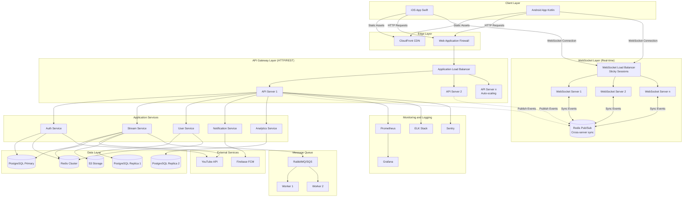

# YouTube Livestream - Full Production System (Scalable to n Users)

## High-Level Architecture




## System Architecture Comparison

### MVP vs 100-User vs Full Production


| Component               | MVP (5-10 users)      | 100-User Scale            | Full Production (1000s+)                  |
| ----------------------- | --------------------- | ------------------------- | ----------------------------------------- |
| **Backend**             | None (Firebase only)  | Single Node.js server     | Load-balanced cluster (5-50 servers)      |
| **Database**            | Firestore             | PostgreSQL on same server | PostgreSQL primary + 2+ read replicas     |
| **Cache**               | None                  | Optional (in-memory)      | Redis cluster (3+ nodes)                  |
| **Auth**                | Firebase Auth         | JWT + YouTube OAuth       | JWT + session mgmt + refresh tokens       |
| **YouTube Integration** | Intent (launches app) | YouTube API (in-app)      | Same + quota management                   |
| **iOS Support**         | None                  | Native Swift app          | Same + advanced features                  |
| **Real-time Updates**   | Firestore listeners   | Polling (simple)          | WebSocket cluster (sticky sessions)       |
| **Hosting**             | Free (Firebase)       | Single $24/month VPS      | AWS/GCP multi-region ($200-2000/mo)       |
| **Monitoring**          | None                  | Basic logging + Sentry    | Full observability stack                  |
| **CDN**                 | None                  | None (not needed)         | CloudFront/Cloudflare                     |
| **Load Balancer**       | None                  | None                      | Application Load Balancer + health checks |
| **Auto-scaling**        | None                  | None                      | Yes (horizontal pod autoscaling)          |
| **Message Queue**       | None                  | None                      | RabbitMQ/SQS for async tasks              |
| **Deployment**          | Firebase CLI          | docker-compose            | Kubernetes/ECS with CI/CD                 |
| **Disaster Recovery**   | None                  | Manual backups            | Automated backups + multi-region failover |
| **Security**            | Basic                 | Standard best practices   | Enterprise-grade (WAF, DDoS, encryption)  |
| **Cost**                | $0/month              | ~$25-50/month             | ~$200-2000/month                          |
| **Supports**            | 5-10 concurrent       | ~100 concurrent           | 1000-100K+ concurrent                     |


## Core Infrastructure Components

### 1. Backend API Cluster

**Technology Stack**:

- **Runtime**: Node.js 20 LTS
- **Framework**: Express.js or Fastify
- **API Pattern**: RESTful + GraphQL (optional)
- **Real-time**: Socket.io cluster with Redis adapter
- **Process Manager**: PM2 or Kubernetes

**Production Server Architecture**:

```
backend/
├── src/
│   ├── api/
│   │   ├── v1/
│   │   │   ├── auth/
│   │   │   │   ├── auth.controller.ts
│   │   │   │   ├── auth.service.ts
│   │   │   │   ├── auth.validator.ts
│   │   │   │   └── auth.routes.ts
│   │   │   ├── streams/
│   │   │   │   ├── stream.controller.ts
│   │   │   │   ├── stream.service.ts
│   │   │   │   ├── stream.validator.ts
│   │   │   │   └── stream.routes.ts
│   │   │   ├── users/
│   │   │   ├── analytics/
│   │   │   └── notifications/
│   │   └── v2/ (future versioning)
│   ├── services/
│   │   ├── youtube/
│   │   │   ├── youtube.service.ts
│   │   │   ├── youtube.quota.ts
│   │   │   └── youtube.types.ts
│   │   ├── cache/
│   │   │   ├── cache.service.ts
│   │   │   └── cache.strategies.ts
│   │   ├── queue/
│   │   │   ├── queue.service.ts
│   │   │   └── workers/
│   │   ├── storage/
│   │   │   ├── s3.service.ts
│   │   │   └── cdn.service.ts
│   │   ├── notification/
│   │   │   ├── fcm.service.ts
│   │   │   └── push.service.ts
│   │   └── auth/
│   │       ├── jwt.service.ts
│   │       ├── session.service.ts
│   │       └── oauth.service.ts
│   ├── middleware/
│   │   ├── auth.middleware.ts
│   │   ├── rateLimit.middleware.ts
│   │   ├── validation.middleware.ts
│   │   ├── error.middleware.ts
│   │   ├── logging.middleware.ts
│   │   └── metrics.middleware.ts
│   ├── models/
│   │   ├── User.model.ts
│   │   ├── Stream.model.ts
│   │   ├── Broadcast.model.ts
│   │   ├── Session.model.ts
│   │   └── Analytics.model.ts
│   ├── database/
│   │   ├── migrations/
│   │   ├── seeds/
│   │   ├── connection.ts
│   │   └── pool.ts
│   ├── websocket/
│   │   ├── socket.server.ts
│   │   ├── socket.handlers.ts
│   │   └── socket.auth.ts
│   ├── utils/
│   │   ├── logger.ts
│   │   ├── crypto.ts
│   │   ├── validators.ts
│   │   └── helpers.ts
│   ├── config/
│   │   ├── database.config.ts
│   │   ├── redis.config.ts
│   │   ├── youtube.config.ts
│   │   ├── aws.config.ts
│   │   └── index.ts
│   └── server.ts
├── tests/
│   ├── unit/
│   ├── integration/
│   └── e2e/
├── .github/
│   └── workflows/
│       ├── ci.yml
│       └── cd.yml
├── k8s/ (Kubernetes manifests)
│   ├── deployment.yaml
│   ├── service.yaml
│   ├── hpa.yaml (horizontal pod autoscaler)
│   └── ingress.yaml
├── docker/
│   ├── Dockerfile
│   ├── Dockerfile.dev
│   └── docker-compose.yml
├── package.json
├── tsconfig.json
└── README.md
```

**API Endpoints** (Production-ready):

```typescript
// Authentication & Authorization
POST   /api/v1/auth/register
POST   /api/v1/auth/login
POST   /api/v1/auth/logout
POST   /api/v1/auth/refresh
GET    /api/v1/auth/youtube/authorize
GET    /api/v1/auth/youtube/callback
POST   /api/v1/auth/youtube/revoke
DELETE /api/v1/auth/sessions/:id        // Revoke specific session
DELETE /api/v1/auth/sessions/all        // Revoke all sessions

// User Management
GET    /api/v1/users/me
PUT    /api/v1/users/me
PATCH  /api/v1/users/me/avatar
GET    /api/v1/users/:id
GET    /api/v1/users/:id/streams
POST   /api/v1/users/:id/follow
DELETE /api/v1/users/:id/follow
GET    /api/v1/users/:id/followers
GET    /api/v1/users/:id/following
DELETE /api/v1/users/me                 // GDPR: Delete account
GET    /api/v1/users/me/export          // GDPR: Export data

// Stream Management
GET    /api/v1/streams                  // List streams (with filters)
GET    /api/v1/streams/live             // Live streams only
GET    /api/v1/streams/trending         // Trending streams
GET    /api/v1/streams/:id
POST   /api/v1/streams                  // Create broadcast
PUT    /api/v1/streams/:id
PATCH  /api/v1/streams/:id/thumbnail
DELETE /api/v1/streams/:id
POST   /api/v1/streams/:id/start
POST   /api/v1/streams/:id/stop
GET    /api/v1/streams/:id/status
GET    /api/v1/streams/:id/health
POST   /api/v1/streams/:id/view         // Track view

// YouTube Integration
POST   /api/v1/youtube/broadcast/create
POST   /api/v1/youtube/broadcast/bind
POST   /api/v1/youtube/broadcast/transition
GET    /api/v1/youtube/broadcast/:id/status
GET    /api/v1/youtube/stream/key
GET    /api/v1/youtube/quota              // Quota usage

// Analytics
GET    /api/v1/analytics/streams/:id
GET    /api/v1/analytics/user/:id
GET    /api/v1/analytics/dashboard
POST   /api/v1/analytics/events

// Notifications
GET    /api/v1/notifications
PUT    /api/v1/notifications/:id/read
DELETE /api/v1/notifications/:id
POST   /api/v1/notifications/device      // Register FCM token

// Health & Metrics
GET    /health                            // Health check
GET    /ready                             // Readiness probe
GET    /metrics                           // Prometheus metrics
GET    /version                           // API version info

// WebSocket
WS     /ws                                // WebSocket connection
```

### 2. Database Layer (PostgreSQL)

**Production Schema with Optimization**:

```sql
-- Enable extensions
CREATE EXTENSION IF NOT EXISTS "uuid-ossp";
CREATE EXTENSION IF NOT EXISTS "pg_stat_statements";

-- Users table
CREATE TABLE users (
    id UUID PRIMARY KEY DEFAULT uuid_generate_v4(),
    email VARCHAR(255) UNIQUE NOT NULL,
    username VARCHAR(100) UNIQUE NOT NULL,
    password_hash VARCHAR(255),
    avatar_url TEXT,
    bio TEXT,
    youtube_channel_id VARCHAR(100),
    youtube_refresh_token TEXT, -- Encrypted
    is_verified BOOLEAN DEFAULT FALSE,
    is_active BOOLEAN DEFAULT TRUE,
    role VARCHAR(50) DEFAULT 'user', -- user, premium, admin
    created_at TIMESTAMP DEFAULT NOW(),
    updated_at TIMESTAMP DEFAULT NOW(),
    last_login_at TIMESTAMP,
    settings JSONB DEFAULT '{}'::jsonb,
    metadata JSONB DEFAULT '{}'::jsonb
);

CREATE INDEX idx_users_email ON users(email);
CREATE INDEX idx_users_username ON users(username);
CREATE INDEX idx_users_youtube_channel ON users(youtube_channel_id);
CREATE INDEX idx_users_active ON users(is_active) WHERE is_active = TRUE;
CREATE INDEX idx_users_settings ON users USING GIN(settings);

-- Streams table (partitioned by created_at)
CREATE TABLE streams (
    id UUID PRIMARY KEY DEFAULT uuid_generate_v4(),
    user_id UUID NOT NULL REFERENCES users(id) ON DELETE CASCADE,
    title VARCHAR(255) NOT NULL,
    description TEXT,
    youtube_broadcast_id VARCHAR(100) UNIQUE,
    youtube_video_id VARCHAR(100),
    youtube_stream_key TEXT, -- Encrypted
    youtube_rtmp_url TEXT,
    stream_key VARCHAR(100) UNIQUE,
    status VARCHAR(50) DEFAULT 'created',
    is_public BOOLEAN DEFAULT TRUE,
    scheduled_start_time TIMESTAMP,
    actual_start_time TIMESTAMP,
    end_time TIMESTAMP,
    thumbnail_url TEXT,
    viewer_count INTEGER DEFAULT 0,
    peak_viewer_count INTEGER DEFAULT 0,
    total_views INTEGER DEFAULT 0,
    like_count INTEGER DEFAULT 0,
    category VARCHAR(100),
    tags JSONB DEFAULT '[]'::jsonb,
    metadata JSONB DEFAULT '{}'::jsonb,
    created_at TIMESTAMP DEFAULT NOW(),
    updated_at TIMESTAMP DEFAULT NOW()
) PARTITION BY RANGE (created_at);

-- Create partitions (monthly)
CREATE TABLE streams_2026_01 PARTITION OF streams
    FOR VALUES FROM ('2026-01-01') TO ('2026-02-01');
CREATE TABLE streams_2026_02 PARTITION OF streams
    FOR VALUES FROM ('2026-02-01') TO ('2026-03-01');
CREATE TABLE streams_2026_03 PARTITION OF streams
    FOR VALUES FROM ('2026-03-01') TO ('2026-04-01');
-- ... continue for all months

CREATE INDEX idx_streams_user_id ON streams(user_id);
CREATE INDEX idx_streams_status ON streams(status);
CREATE INDEX idx_streams_scheduled_start ON streams(scheduled_start_time);
CREATE INDEX idx_streams_youtube_broadcast ON streams(youtube_broadcast_id);
CREATE INDEX idx_streams_live_public ON streams(status, is_public, actual_start_time DESC) 
    WHERE status = 'live' AND is_public = TRUE;
CREATE INDEX idx_streams_tags ON streams USING GIN(tags);

-- Stream analytics (time-series data, partitioned)
CREATE TABLE stream_analytics (
    id UUID PRIMARY KEY DEFAULT uuid_generate_v4(),
    stream_id UUID NOT NULL REFERENCES streams(id) ON DELETE CASCADE,
    timestamp TIMESTAMP NOT NULL DEFAULT NOW(),
    viewer_count INTEGER,
    like_count INTEGER,
    chat_message_count INTEGER,
    bandwidth_mbps DECIMAL(10,2),
    frame_rate INTEGER,
    resolution VARCHAR(20),
    health_status VARCHAR(50),
    bitrate_kbps INTEGER,
    dropped_frames INTEGER,
    cpu_usage DECIMAL(5,2),
    memory_usage DECIMAL(5,2),
    error_count INTEGER DEFAULT 0,
    metadata JSONB DEFAULT '{}'::jsonb
) PARTITION BY RANGE (timestamp);

-- Create analytics partitions (weekly for better query performance)
CREATE TABLE stream_analytics_2026_w11 PARTITION OF stream_analytics
    FOR VALUES FROM ('2026-03-10') TO ('2026-03-17');
CREATE TABLE stream_analytics_2026_w12 PARTITION OF stream_analytics
    FOR VALUES FROM ('2026-03-17') TO ('2026-03-24');
-- ... continue

CREATE INDEX idx_analytics_stream_id ON stream_analytics(stream_id, timestamp DESC);
CREATE INDEX idx_analytics_timestamp ON stream_analytics(timestamp DESC);

-- User sessions (for JWT refresh token management)
CREATE TABLE sessions (
    id UUID PRIMARY KEY DEFAULT uuid_generate_v4(),
    user_id UUID NOT NULL REFERENCES users(id) ON DELETE CASCADE,
    token_hash VARCHAR(255) NOT NULL,
    refresh_token_hash VARCHAR(255) UNIQUE,
    device_info JSONB,
    ip_address INET,
    user_agent TEXT,
    expires_at TIMESTAMP NOT NULL,
    last_used_at TIMESTAMP DEFAULT NOW(),
    created_at TIMESTAMP DEFAULT NOW()
);

CREATE INDEX idx_sessions_user_id ON sessions(user_id);
CREATE INDEX idx_sessions_token ON sessions(token_hash);
CREATE INDEX idx_sessions_refresh_token ON sessions(refresh_token_hash);
CREATE INDEX idx_sessions_expires ON sessions(expires_at) WHERE expires_at > NOW();

-- Notifications
CREATE TABLE notifications (
    id UUID PRIMARY KEY DEFAULT uuid_generate_v4(),
    user_id UUID NOT NULL REFERENCES users(id) ON DELETE CASCADE,
    type VARCHAR(50) NOT NULL,
    title VARCHAR(255),
    message TEXT,
    data JSONB DEFAULT '{}'::jsonb,
    is_read BOOLEAN DEFAULT FALSE,
    read_at TIMESTAMP,
    created_at TIMESTAMP DEFAULT NOW()
) PARTITION BY RANGE (created_at);

-- Notification partitions (monthly)
CREATE TABLE notifications_2026_03 PARTITION OF notifications
    FOR VALUES FROM ('2026-03-01') TO ('2026-04-01');

CREATE INDEX idx_notifications_user_id ON notifications(user_id, created_at DESC);
CREATE INDEX idx_notifications_unread ON notifications(user_id, is_read, created_at DESC) 
    WHERE is_read = FALSE;

-- Followers (social features)
CREATE TABLE followers (
    id UUID PRIMARY KEY DEFAULT uuid_generate_v4(),
    follower_id UUID NOT NULL REFERENCES users(id) ON DELETE CASCADE,
    following_id UUID NOT NULL REFERENCES users(id) ON DELETE CASCADE,
    created_at TIMESTAMP DEFAULT NOW(),
    UNIQUE(follower_id, following_id)
);

CREATE INDEX idx_followers_follower ON followers(follower_id);
CREATE INDEX idx_followers_following ON followers(following_id);

-- Stream views (for analytics)
CREATE TABLE stream_views (
    id UUID PRIMARY KEY DEFAULT uuid_generate_v4(),
    stream_id UUID NOT NULL REFERENCES streams(id) ON DELETE CASCADE,
    user_id UUID REFERENCES users(id) ON DELETE SET NULL,
    ip_address INET,
    user_agent TEXT,
    watch_duration_seconds INTEGER,
    viewed_at TIMESTAMP DEFAULT NOW()
) PARTITION BY RANGE (viewed_at);

-- Views partitions (daily for high volume)
CREATE TABLE stream_views_2026_03_17 PARTITION OF stream_views
    FOR VALUES FROM ('2026-03-17') TO ('2026-03-18');

CREATE INDEX idx_views_stream ON stream_views(stream_id, viewed_at DESC);
CREATE INDEX idx_views_user ON stream_views(user_id, viewed_at DESC);

-- Audit log (for security)
CREATE TABLE audit_logs (
    id UUID PRIMARY KEY DEFAULT uuid_generate_v4(),
    user_id UUID REFERENCES users(id) ON DELETE SET NULL,
    action VARCHAR(100) NOT NULL,
    resource_type VARCHAR(50),
    resource_id UUID,
    ip_address INET,
    user_agent TEXT,
    details JSONB DEFAULT '{}'::jsonb,
    created_at TIMESTAMP DEFAULT NOW()
) PARTITION BY RANGE (created_at);

CREATE TABLE audit_logs_2026_03 PARTITION OF audit_logs
    FOR VALUES FROM ('2026-03-01') TO ('2026-04-01');

CREATE INDEX idx_audit_user ON audit_logs(user_id, created_at DESC);
CREATE INDEX idx_audit_action ON audit_logs(action, created_at DESC);

-- Materialized views for performance
CREATE MATERIALIZED VIEW trending_streams AS
SELECT 
    s.id,
    s.title,
    s.user_id,
    s.thumbnail_url,
    s.viewer_count,
    s.actual_start_time,
    COUNT(DISTINCT sv.id) as total_views,
    COUNT(DISTINCT sv.user_id) as unique_viewers,
    (COUNT(DISTINCT sv.id) * 0.6 + s.viewer_count * 0.4) as engagement_score,
    u.username,
    u.avatar_url
FROM streams s
LEFT JOIN stream_views sv ON s.id = sv.stream_id 
    AND sv.viewed_at > NOW() - INTERVAL '24 hours'
INNER JOIN users u ON s.user_id = u.id
WHERE s.status IN ('live', 'ended')
  AND s.is_public = TRUE
  AND s.actual_start_time > NOW() - INTERVAL '24 hours'
GROUP BY s.id, u.username, u.avatar_url
ORDER BY engagement_score DESC
LIMIT 100;

CREATE UNIQUE INDEX idx_trending_streams ON trending_streams(id);
CREATE INDEX idx_trending_score ON trending_streams(engagement_score DESC);

-- Refresh materialized view every 5 minutes (via cron job or trigger)
-- REFRESH MATERIALIZED VIEW CONCURRENTLY trending_streams;

-- Database functions for common operations
CREATE OR REPLACE FUNCTION update_updated_at()
RETURNS TRIGGER AS $$
BEGIN
    NEW.updated_at = NOW();
    RETURN NEW;
END;
$$ LANGUAGE plpgsql;

-- Apply trigger to all tables with updated_at
CREATE TRIGGER users_updated_at BEFORE UPDATE ON users
    FOR EACH ROW EXECUTE FUNCTION update_updated_at();
CREATE TRIGGER streams_updated_at BEFORE UPDATE ON streams
    FOR EACH ROW EXECUTE FUNCTION update_updated_at();

-- Function to increment view count atomically
CREATE OR REPLACE FUNCTION increment_stream_views(stream_uuid UUID)
RETURNS VOID AS $$
BEGIN
    UPDATE streams SET 
        viewer_count = viewer_count + 1,
        total_views = total_views + 1,
        peak_viewer_count = GREATEST(peak_viewer_count, viewer_count + 1)
    WHERE id = stream_uuid;
END;
$$ LANGUAGE plpgsql;
```

**Database Connection Pooling**:

```typescript
// database/pool.ts
import { Pool } from 'pg';

// Primary database (writes)
export const primaryPool = new Pool({
  host: process.env.DB_PRIMARY_HOST,
  port: parseInt(process.env.DB_PRIMARY_PORT),
  database: process.env.DB_NAME,
  user: process.env.DB_USER,
  password: process.env.DB_PASSWORD,
  max: 50, // Maximum connections
  idleTimeoutMillis: 30000,
  connectionTimeoutMillis: 2000,
  ssl: {
    rejectUnauthorized: true,
    ca: process.env.DB_SSL_CA,
  },
});

// Read replica pool (reads)
export const replicaPool = new Pool({
  host: process.env.DB_REPLICA_HOST,
  port: parseInt(process.env.DB_REPLICA_PORT),
  database: process.env.DB_NAME,
  user: process.env.DB_USER,
  password: process.env.DB_PASSWORD,
  max: 100, // More connections for reads
  idleTimeoutMillis: 30000,
  connectionTimeoutMillis: 2000,
  ssl: {
    rejectUnauthorized: true,
    ca: process.env.DB_SSL_CA,
  },
});

// Smart query router
export async function query(sql: string, params: any[], useReplica = false) {
  const pool = useReplica && process.env.NODE_ENV === 'production' 
    ? replicaPool 
    : primaryPool;
  
  const start = Date.now();
  try {
    const result = await pool.query(sql, params);
    const duration = Date.now() - start;
    
    // Log slow queries
    if (duration > 1000) {
      logger.warn('Slow query detected', { sql, duration, params });
    }
    
    return result;
  } catch (error) {
    logger.error('Database query error', { sql, error, params });
    throw error;
  }
}
```

### 3. Redis Cache Layer

**Redis Cluster Configuration**:

```typescript
// config/redis.config.ts
import Redis from 'ioredis';

// Redis cluster for caching
export const redisCluster = new Redis.Cluster([
  {
    host: process.env.REDIS_NODE_1_HOST,
    port: parseInt(process.env.REDIS_NODE_1_PORT),
  },
  {
    host: process.env.REDIS_NODE_2_HOST,
    port: parseInt(process.env.REDIS_NODE_2_PORT),
  },
  {
    host: process.env.REDIS_NODE_3_HOST,
    port: parseInt(process.env.REDIS_NODE_3_PORT),
  },
], {
  redisOptions: {
    password: process.env.REDIS_PASSWORD,
    tls: process.env.NODE_ENV === 'production' ? {} : undefined,
  },
  enableReadyCheck: true,
  maxRetriesPerRequest: 3,
});

// Separate Redis for session management
export const redisSession = new Redis({
  host: process.env.REDIS_SESSION_HOST,
  port: parseInt(process.env.REDIS_SESSION_PORT),
  password: process.env.REDIS_SESSION_PASSWORD,
  db: 0,
  tls: process.env.NODE_ENV === 'production' ? {} : undefined,
});

// Redis for WebSocket pub/sub
export const redisPubSub = new Redis({
  host: process.env.REDIS_PUBSUB_HOST,
  port: parseInt(process.env.REDIS_PUBSUB_PORT),
  password: process.env.REDIS_PUBSUB_PASSWORD,
  db: 1,
});
```

**Caching Strategy**:

```typescript
// services/cache/cache.service.ts
import { redisCluster } from '../../config/redis.config';
import { logger } from '../../utils/logger';

export const CACHE_KEYS = {
  USER: (userId: string) => `user:${userId}`,
  USER_STREAMS: (userId: string) => `user:${userId}:streams`,
  LIVE_STREAMS: () => `streams:live`,
  STREAM_DETAIL: (streamId: string) => `stream:${streamId}`,
  STREAM_VIEWERS: (streamId: string) => `stream:${streamId}:viewers`,
  STREAM_ANALYTICS: (streamId: string) => `stream:${streamId}:analytics`,
  YOUTUBE_TOKEN: (userId: string) => `youtube:token:${userId}`,
  YOUTUBE_QUOTA: (userId: string) => `youtube:quota:${userId}`,
  TRENDING: () => `streams:trending`,
  USER_FOLLOWERS: (userId: string) => `user:${userId}:followers`,
  USER_FOLLOWING: (userId: string) => `user:${userId}:following`,
};

export const CACHE_TTL = {
  USER: 3600,                 // 1 hour
  USER_STREAMS: 300,          // 5 minutes
  LIVE_STREAMS: 30,           // 30 seconds
  STREAM_DETAIL: 60,          // 1 minute
  STREAM_ANALYTICS: 10,       // 10 seconds
  TRENDING: 300,              // 5 minutes
  YOUTUBE_TOKEN: 3500,        // 58 minutes (tokens expire at 60)
  YOUTUBE_QUOTA: 3600,        // 1 hour
  USER_SOCIAL: 600,           // 10 minutes
};

export class CacheService {
  // Get with automatic JSON parsing
  async get<T>(key: string): Promise<T | null> {
    try {
      const value = await redisCluster.get(key);
      return value ? JSON.parse(value) : null;
    } catch (error) {
      logger.error('Cache get error', { key, error });
      return null;
    }
  }

  // Set with automatic JSON stringification
  async set(key: string, value: any, ttl?: number): Promise<void> {
    try {
      const serialized = JSON.stringify(value);
      if (ttl) {
        await redisCluster.setex(key, ttl, serialized);
      } else {
        await redisCluster.set(key, serialized);
      }
    } catch (error) {
      logger.error('Cache set error', { key, error });
    }
  }

  // Delete key(s)
  async del(...keys: string[]): Promise<void> {
    try {
      await redisCluster.del(...keys);
    } catch (error) {
      logger.error('Cache delete error', { keys, error });
    }
  }

  // Invalidate pattern
  async invalidatePattern(pattern: string): Promise<void> {
    try {
      const keys = await redisCluster.keys(pattern);
      if (keys.length > 0) {
        await redisCluster.del(...keys);
      }
    } catch (error) {
      logger.error('Cache invalidate pattern error', { pattern, error });
    }
  }

  // Cache-aside pattern
  async getOrFetch<T>(
    key: string,
    fetcher: () => Promise<T>,
    ttl: number
  ): Promise<T> {
    // Try cache first
    const cached = await this.get<T>(key);
    if (cached !== null) {
      return cached;
    }

    // Cache miss - fetch from source
    const value = await fetcher();
    
    // Store in cache
    await this.set(key, value, ttl);
    
    return value;
  }

  // Real-time viewer tracking (sorted set)
  async trackViewer(streamId: string, userId: string): Promise<void> {
    const key = CACHE_KEYS.STREAM_VIEWERS(streamId);
    const score = Date.now();
    await redisCluster.zadd(key, score, userId);
    await redisCluster.expire(key, 3600); // 1 hour expiry
  }

  async untrackViewer(streamId: string, userId: string): Promise<void> {
    const key = CACHE_KEYS.STREAM_VIEWERS(streamId);
    await redisCluster.zrem(key, userId);
  }

  async getViewerCount(streamId: string): Promise<number> {
    const key = CACHE_KEYS.STREAM_VIEWERS(streamId);
    const now = Date.now();
    const thirtySecondsAgo = now - 30000;
    
    // Remove stale viewers
    await redisCluster.zremrangebyscore(key, 0, thirtySecondsAgo);
    
    // Count active viewers
    return await redisCluster.zcard(key);
  }

  // Rate limiting
  async checkRateLimit(
    identifier: string,
    limit: number,
    windowSeconds: number
  ): Promise<{ allowed: boolean; remaining: number }> {
    const key = `ratelimit:${identifier}`;
    
    const count = await redisCluster.incr(key);
    if (count === 1) {
      await redisCluster.expire(key, windowSeconds);
    }
    
    const allowed = count <= limit;
    const remaining = Math.max(0, limit - count);
    
    return { allowed, remaining };
  }
}

export const cacheService = new CacheService();
```

### 4. WebSocket Real-time Layer

**WebSocket Cluster with Redis Adapter**:

```typescript
// websocket/socket.server.ts
import { Server } from 'socket.io';
import { createAdapter } from '@socket.io/redis-adapter';
import { redisPubSub } from '../config/redis.config';
import { verifyToken } from '../services/auth/jwt.service';
import { cacheService } from '../services/cache/cache.service';
import { logger } from '../utils/logger';

export class WebSocketServer {
  private io: Server;

  initialize(httpServer: any) {
    this.io = new Server(httpServer, {
      cors: {
        origin: process.env.ALLOWED_ORIGINS?.split(',') || [],
        credentials: true,
      },
      transports: ['websocket', 'polling'],
      pingTimeout: 60000,
      pingInterval: 25000,
    });

    // Redis adapter for multi-server support
    const pubClient = redisPubSub.duplicate();
    const subClient = redisPubSub.duplicate();
    this.io.adapter(createAdapter(pubClient, subClient));

    // Authentication middleware
    this.io.use(async (socket, next) => {
      try {
        const token = socket.handshake.auth.token;
        if (!token) {
          return next(new Error('Authentication required'));
        }

        const decoded = await verifyToken(token);
        socket.data.userId = decoded.userId;
        socket.data.username = decoded.username;
        next();
      } catch (error) {
        next(new Error('Invalid token'));
      }
    });

    this.setupEventHandlers();
  }

  private setupEventHandlers() {
    this.io.on('connection', (socket) => {
      const userId = socket.data.userId;
      logger.info('WebSocket connected', { userId, socketId: socket.id });

      // Join user's personal room
      socket.join(`user:${userId}`);

      // Subscribe to stream
      socket.on('stream:subscribe', async (streamId: string) => {
        socket.join(`stream:${streamId}`);
        
        // Track viewer
        await cacheService.trackViewer(streamId, userId);
        
        // Broadcast updated viewer count
        const viewerCount = await cacheService.getViewerCount(streamId);
        this.io.to(`stream:${streamId}`).emit('stream:viewers', { 
          streamId, 
          count: viewerCount 
        });
        
        logger.debug('User subscribed to stream', { userId, streamId });
      });

      // Unsubscribe from stream
      socket.on('stream:unsubscribe', async (streamId: string) => {
        socket.leave(`stream:${streamId}`);
        
        // Untrack viewer
        await cacheService.untrackViewer(streamId, userId);
        
        // Broadcast updated viewer count
        const viewerCount = await cacheService.getViewerCount(streamId);
        this.io.to(`stream:${streamId}`).emit('stream:viewers', { 
          streamId, 
          count: viewerCount 
        });
        
        logger.debug('User unsubscribed from stream', { userId, streamId });
      });

      // Heartbeat for active viewers
      socket.on('stream:heartbeat', async (streamId: string) => {
        await cacheService.trackViewer(streamId, userId);
      });

      // Handle disconnect
      socket.on('disconnect', async (reason) => {
        logger.info('WebSocket disconnected', { userId, reason });
        
        // Untrack from all streams
        const rooms = Array.from(socket.rooms);
        for (const room of rooms) {
          if (room.startsWith('stream:')) {
            const streamId = room.split(':')[1];
            await cacheService.untrackViewer(streamId, userId);
            
            const viewerCount = await cacheService.getViewerCount(streamId);
            this.io.to(`stream:${streamId}`).emit('stream:viewers', { 
              streamId, 
              count: viewerCount 
            });
          }
        }
      });
    });
  }

  // Public methods to broadcast events
  notifyStreamStarted(streamId: string, data: any) {
    this.io.emit('stream:started', { streamId, ...data });
  }

  notifyStreamEnded(streamId: string, data: any) {
    this.io.to(`stream:${streamId}`).emit('stream:ended', { streamId, ...data });
  }

  updateStreamStatus(streamId: string, status: string, data?: any) {
    this.io.to(`stream:${streamId}`).emit('stream:status', { 
      streamId, 
      status, 
      ...data 
    });
  }

  notifyUser(userId: string, event: string, data: any) {
    this.io.to(`user:${userId}`).emit(event, data);
  }

  notifyFollowers(userId: string, event: string, data: any) {
    // This would query followers from database/cache
    // and emit to each follower's room
    this.io.emit(`user:${userId}:followers`, event, data);
  }

  broadcastToAll(event: string, data: any) {
    this.io.emit(event, data);
  }

  getOnlineUsersCount(): number {
    return this.io.sockets.sockets.size;
  }

  getRoomSize(room: string): number {
    return this.io.sockets.adapter.rooms.get(room)?.size || 0;
  }
}

export const wsServer = new WebSocketServer();
```

### 5. Message Queue for Async Tasks

**Queue Service (RabbitMQ/SQS)**:

```typescript
// services/queue/queue.service.ts
import amqp from 'amqplib';
import { logger } from '../../utils/logger';

export enum QueueName {
  STREAM_PROCESSING = 'stream_processing',
  NOTIFICATIONS = 'notifications',
  ANALYTICS = 'analytics',
  VIDEO_THUMBNAIL = 'video_thumbnail',
  EMAIL = 'email',
}

export class QueueService {
  private connection: amqp.Connection;
  private channel: amqp.Channel;

  async initialize() {
    try {
      this.connection = await amqp.connect(process.env.RABBITMQ_URL);
      this.channel = await this.connection.createChannel();

      // Declare queues
      for (const queueName of Object.values(QueueName)) {
        await this.channel.assertQueue(queueName, { durable: true });
      }

      logger.info('Queue service initialized');
    } catch (error) {
      logger.error('Failed to initialize queue service', { error });
      throw error;
    }
  }

  async publish(queue: QueueName, message: any) {
    try {
      const content = Buffer.from(JSON.stringify(message));
      this.channel.sendToQueue(queue, content, { persistent: true });
      logger.debug('Message published to queue', { queue, message });
    } catch (error) {
      logger.error('Failed to publish message', { queue, error });
      throw error;
    }
  }

  async consume(queue: QueueName, handler: (message: any) => Promise<void>) {
    try {
      await this.channel.consume(queue, async (msg) => {
        if (!msg) return;

        try {
          const content = JSON.parse(msg.content.toString());
          await handler(content);
          this.channel.ack(msg);
        } catch (error) {
          logger.error('Failed to process message', { queue, error });
          // Reject and requeue (or send to dead letter queue)
          this.channel.nack(msg, false, false);
        }
      });

      logger.info('Queue consumer started', { queue });
    } catch (error) {
      logger.error('Failed to start consumer', { queue, error });
      throw error;
    }
  }
}

export const queueService = new QueueService();
```

**Worker Processes**:

```typescript
// workers/stream-processing.worker.ts
import { queueService, QueueName } from '../services/queue/queue.service';
import { youtubeService } from '../services/youtube/youtube.service';
import { db } from '../database/connection';

async function processStreamJob(job: any) {
  const { type, streamId, userId } = job;

  switch (type) {
    case 'generate_thumbnail':
      // Generate thumbnail from YouTube video
      const broadcast = await youtubeService.getBroadcastDetails(userId, streamId);
      const thumbnailUrl = broadcast.snippet.thumbnails.high.url;
      await db.streams.update(streamId, { thumbnail_url: thumbnailUrl });
      break;

    case 'update_analytics':
      // Fetch and store analytics
      const analytics = await youtubeService.getStreamAnalytics(userId, streamId);
      await db.streamAnalytics.insert({
        stream_id: streamId,
        viewer_count: analytics.concurrentViewers,
        timestamp: new Date(),
      });
      break;

    case 'stream_ended':
      // Perform cleanup when stream ends
      await db.streams.update(streamId, { 
        status: 'ended', 
        end_time: new Date() 
      });
      // Send notifications to followers
      await queueService.publish(QueueName.NOTIFICATIONS, {
        type: 'stream_ended',
        streamId,
        userId,
      });
      break;

    default:
      throw new Error(`Unknown job type: ${type}`);
  }
}

// Start worker
queueService.consume(QueueName.STREAM_PROCESSING, processStreamJob);
```

### 6. CDN and Static Assets

**AWS CloudFront Configuration**:

```typescript
// services/storage/cdn.service.ts
import { S3 } from '@aws-sdk/client-s3';
import { CloudFront } from '@aws-sdk/client-cloudfront';
import { getSignedUrl } from '@aws-sdk/cloudfront-signer';

const s3 = new S3({
  region: process.env.AWS_REGION,
  credentials: {
    accessKeyId: process.env.AWS_ACCESS_KEY_ID,
    secretAccessKey: process.env.AWS_SECRET_ACCESS_KEY,
  },
});

const cloudfront = new CloudFront({
  region: process.env.AWS_REGION,
});

export class CDNService {
  private bucketName = process.env.S3_BUCKET_NAME;
  private cloudfrontDomain = process.env.CLOUDFRONT_DOMAIN;
  private cloudfrontKeyPairId = process.env.CLOUDFRONT_KEY_PAIR_ID;
  private cloudfrontPrivateKey = process.env.CLOUDFRONT_PRIVATE_KEY;

  // Upload file to S3
  async uploadFile(
    key: string,
    body: Buffer,
    contentType: string
  ): Promise<string> {
    await s3.putObject({
      Bucket: this.bucketName,
      Key: key,
      Body: body,
      ContentType: contentType,
      CacheControl: 'max-age=31536000', // 1 year
      ServerSideEncryption: 'AES256',
    });

    return `https://${this.cloudfrontDomain}/${key}`;
  }

  // Upload thumbnail
  async uploadThumbnail(
    streamId: string,
    image: Buffer
  ): Promise<string> {
    const key = `thumbnails/${streamId}.jpg`;
    return await this.uploadFile(key, image, 'image/jpeg');
  }

  // Upload user avatar
  async uploadAvatar(
    userId: string,
    image: Buffer
  ): Promise<string> {
    const key = `avatars/${userId}.jpg`;
    return await this.uploadFile(key, image, 'image/jpeg');
  }

  // Generate signed URL for private content
  generateSignedUrl(
    key: string,
    expiresIn: number = 3600
  ): string {
    const url = `https://${this.cloudfrontDomain}/${key}`;
    const signedUrl = getSignedUrl({
      url,
      keyPairId: this.cloudfrontKeyPairId,
      privateKey: this.cloudfrontPrivateKey,
      dateLessThan: new Date(Date.now() + expiresIn * 1000).toISOString(),
    });
    return signedUrl;
  }

  // Invalidate cache
  async invalidateCache(paths: string[]): Promise<void> {
    await cloudfront.createInvalidation({
      DistributionId: process.env.CLOUDFRONT_DISTRIBUTION_ID,
      InvalidationBatch: {
        CallerReference: Date.now().toString(),
        Paths: {
          Quantity: paths.length,
          Items: paths,
        },
      },
    });
  }
}

export const cdnService = new CDNService();
```

### 7. Monitoring and Observability

**Prometheus Metrics**:

```typescript
// middleware/metrics.middleware.ts
import promClient from 'prom-client';

const register = new promClient.Registry();

// Collect default metrics
promClient.collectDefaultMetrics({ register });

// HTTP request duration
export const httpRequestDuration = new promClient.Histogram({
  name: 'http_request_duration_seconds',
  help: 'Duration of HTTP requests in seconds',
  labelNames: ['method', 'route', 'status_code'],
  buckets: [0.1, 0.5, 1, 2, 5, 10],
  registers: [register],
});

// HTTP request total
export const httpRequestTotal = new promClient.Counter({
  name: 'http_requests_total',
  help: 'Total number of HTTP requests',
  labelNames: ['method', 'route', 'status_code'],
  registers: [register],
});

// Active streams
export const activeStreamsGauge = new promClient.Gauge({
  name: 'active_streams_total',
  help: 'Number of currently active streams',
  registers: [register],
});

// Total viewers
export const totalViewersGauge = new promClient.Gauge({
  name: 'total_viewers',
  help: 'Total number of active viewers across all streams',
  registers: [register],
});

// WebSocket connections
export const wsConnectionsGauge = new promClient.Gauge({
  name: 'websocket_connections_total',
  help: 'Number of active WebSocket connections',
  registers: [register],
});

// YouTube API calls
export const youtubeApiCallsTotal = new promClient.Counter({
  name: 'youtube_api_calls_total',
  help: 'Total YouTube API calls',
  labelNames: ['endpoint', 'status'],
  registers: [register],
});

// YouTube API quota usage
export const youtubeQuotaUsage = new promClient.Gauge({
  name: 'youtube_quota_usage',
  help: 'YouTube API quota usage',
  registers: [register],
});

// Database connection pool
export const dbPoolSize = new promClient.Gauge({
  name: 'db_pool_size',
  help: 'Database connection pool size',
  labelNames: ['pool'],
  registers: [register],
});

export const dbPoolIdle = new promClient.Gauge({
  name: 'db_pool_idle',
  help: 'Idle database connections',
  labelNames: ['pool'],
  registers: [register],
});

// Redis operations
export const redisOperationsTotal = new promClient.Counter({
  name: 'redis_operations_total',
  help: 'Total Redis operations',
  labelNames: ['operation', 'status'],
  registers: [register],
});

// Cache hit/miss
export const cacheHitRate = new promClient.Counter({
  name: 'cache_requests_total',
  help: 'Cache requests',
  labelNames: ['result'], // 'hit' or 'miss'
  registers: [register],
});

// Metrics endpoint
export function metricsEndpoint() {
  return register.metrics();
}

// Middleware to track HTTP metrics
export function metricsMiddleware(req: any, res: any, next: any) {
  const start = Date.now();

  res.on('finish', () => {
    const duration = (Date.now() - start) / 1000;
    const route = req.route?.path || req.path;
    
    httpRequestDuration
      .labels(req.method, route, res.statusCode)
      .observe(duration);
    
    httpRequestTotal
      .labels(req.method, route, res.statusCode)
      .inc();
  });

  next();
}
```

**Grafana Dashboard Configuration** (JSON):

```json
{
  "dashboard": {
    "title": "Livestream Platform Monitoring",
    "panels": [
      {
        "title": "Active Streams",
        "targets": [
          {
            "expr": "active_streams_total"
          }
        ]
      },
      {
        "title": "Total Viewers",
        "targets": [
          {
            "expr": "total_viewers"
          }
        ]
      },
      {
        "title": "API Request Rate",
        "targets": [
          {
            "expr": "rate(http_requests_total[5m])"
          }
        ]
      },
      {
        "title": "API Response Time (p95)",
        "targets": [
          {
            "expr": "histogram_quantile(0.95, http_request_duration_seconds_bucket)"
          }
        ]
      },
      {
        "title": "Error Rate",
        "targets": [
          {
            "expr": "rate(http_requests_total{status_code=~\"5..\"}[5m])"
          }
        ]
      },
      {
        "title": "YouTube API Quota Usage",
        "targets": [
          {
            "expr": "youtube_quota_usage"
          }
        ]
      },
      {
        "title": "Cache Hit Rate",
        "targets": [
          {
            "expr": "rate(cache_requests_total{result=\"hit\"}[5m]) / rate(cache_requests_total[5m])"
          }
        ]
      },
      {
        "title": "WebSocket Connections",
        "targets": [
          {
            "expr": "websocket_connections_total"
          }
        ]
      }
    ]
  }
}
```

### 8. Auto-scaling Configuration

**Kubernetes Horizontal Pod Autoscaler**:

```yaml
# k8s/hpa.yaml
apiVersion: autoscaling/v2
kind: HorizontalPodAutoscaler
metadata:
  name: api-hpa
spec:
  scaleTargetRef:
    apiVersion: apps/v1
    kind: Deployment
    name: api-deployment
  minReplicas: 5
  maxReplicas: 50
  metrics:
  - type: Resource
    resource:
      name: cpu
      target:
        type: Utilization
        averageUtilization: 70
  - type: Resource
    resource:
      name: memory
      target:
        type: Utilization
        averageUtilization: 80
  - type: Pods
    pods:
      metric:
        name: http_requests_per_second
      target:
        type: AverageValue
        averageValue: "1000"
  behavior:
    scaleDown:
      stabilizationWindowSeconds: 300
      policies:
      - type: Percent
        value: 50
        periodSeconds: 60
    scaleUp:
      stabilizationWindowSeconds: 0
      policies:
      - type: Percent
        value: 100
        periodSeconds: 30
      - type: Pods
        value: 5
        periodSeconds: 30
      selectPolicy: Max
```

**API Deployment**:

```yaml
# k8s/deployment.yaml
apiVersion: apps/v1
kind: Deployment
metadata:
  name: api-deployment
spec:
  replicas: 5
  selector:
    matchLabels:
      app: api
  template:
    metadata:
      labels:
        app: api
    spec:
      containers:
      - name: api
        image: livestreamplus/api:latest
        ports:
        - containerPort: 3000
          name: http
        - containerPort: 3001
          name: metrics
        env:
        - name: NODE_ENV
          value: "production"
        - name: DATABASE_URL
          valueFrom:
            secretKeyRef:
              name: db-secrets
              key: url
        - name: REDIS_URL
          valueFrom:
            secretKeyRef:
              name: redis-secrets
              key: url
        resources:
          requests:
            memory: "2Gi"
            cpu: "1000m"
          limits:
            memory: "4Gi"
            cpu: "2000m"
        livenessProbe:
          httpGet:
            path: /health
            port: 3000
          initialDelaySeconds: 30
          periodSeconds: 10
          timeoutSeconds: 5
          failureThreshold: 3
        readinessProbe:
          httpGet:
            path: /ready
            port: 3000
          initialDelaySeconds: 10
          periodSeconds: 5
          timeoutSeconds: 3
          failureThreshold: 2
      affinity:
        podAntiAffinity:
          preferredDuringSchedulingIgnoredDuringExecution:
          - weight: 100
            podAffinityTerm:
              labelSelector:
                matchExpressions:
                - key: app
                  operator: In
                  values:
                  - api
              topologyKey: kubernetes.io/hostname
```

### 9. CI/CD Pipeline

**GitHub Actions Workflow**:

```yaml
# .github/workflows/ci-cd.yml
name: CI/CD Pipeline

on:
  push:
    branches: [main, develop]
  pull_request:
    branches: [main]

env:
  REGISTRY: ghcr.io
  IMAGE_NAME: ${{ github.repository }}

jobs:
  test:
    runs-on: ubuntu-latest
    strategy:
      matrix:
        node-version: [20.x]
    steps:
      - uses: actions/checkout@v4
      
      - name: Use Node.js ${{ matrix.node-version }}
        uses: actions/setup-node@v4
        with:
          node-version: ${{ matrix.node-version }}
          cache: 'npm'
      
      - name: Install dependencies
        run: npm ci
      
      - name: Run linter
        run: npm run lint
      
      - name: Run tests
        run: npm test
      
      - name: Run security audit
        run: npm audit --audit-level=high
      
      - name: Upload coverage
        uses: codecov/codecov-action@v3
        with:
          files: ./coverage/lcov.info

  build:
    needs: test
    runs-on: ubuntu-latest
    permissions:
      contents: read
      packages: write
    steps:
      - uses: actions/checkout@v4
      
      - name: Log in to Container Registry
        uses: docker/login-action@v3
        with:
          registry: ${{ env.REGISTRY }}
          username: ${{ github.actor }}
          password: ${{ secrets.GITHUB_TOKEN }}
      
      - name: Extract metadata
        id: meta
        uses: docker/metadata-action@v5
        with:
          images: ${{ env.REGISTRY }}/${{ env.IMAGE_NAME }}
          tags: |
            type=ref,event=branch
            type=semver,pattern={{version}}
            type=semver,pattern={{major}}.{{minor}}
            type=sha
      
      - name: Build and push Docker image
        uses: docker/build-push-action@v5
        with:
          context: .
          push: true
          tags: ${{ steps.meta.outputs.tags }}
          labels: ${{ steps.meta.outputs.labels }}
          cache-from: type=gha
          cache-to: type=gha,mode=max

  deploy:
    needs: build
    runs-on: ubuntu-latest
    if: github.ref == 'refs/heads/main'
    steps:
      - uses: actions/checkout@v4
      
      - name: Configure AWS credentials
        uses: aws-actions/configure-aws-credentials@v4
        with:
          aws-access-key-id: ${{ secrets.AWS_ACCESS_KEY_ID }}
          aws-secret-access-key: ${{ secrets.AWS_SECRET_ACCESS_KEY }}
          aws-region: us-east-1
      
      - name: Update kubeconfig
        run: |
          aws eks update-kubeconfig --name livestream-cluster --region us-east-1
      
      - name: Deploy to Kubernetes
        run: |
          kubectl set image deployment/api-deployment \
            api=${{ env.REGISTRY }}/${{ env.IMAGE_NAME }}:sha-${{ github.sha }}
          kubectl rollout status deployment/api-deployment
      
      - name: Run database migrations
        run: |
          kubectl exec deployment/api-deployment -- npm run db:migrate
      
      - name: Notify Slack
        uses: slackapi/slack-github-action@v1
        with:
          webhook-url: ${{ secrets.SLACK_WEBHOOK }}
          payload: |
            {
              "text": "Deployment completed: ${{ github.sha }}"
            }

  mobile-android:
    needs: test
    runs-on: ubuntu-latest
    steps:
      - uses: actions/checkout@v4
      
      - name: Set up JDK 17
        uses: actions/setup-java@v4
        with:
          distribution: 'temurin'
          java-version: '17'
      
      - name: Build Android APK
        run: |
          cd android
          ./gradlew assembleRelease
      
      - name: Sign APK
        uses: r0adkll/sign-android-release@v1
        with:
          releaseDirectory: android/app/build/outputs/apk/release
          signingKeyBase64: ${{ secrets.SIGNING_KEY }}
          alias: ${{ secrets.ALIAS }}
          keyStorePassword: ${{ secrets.KEY_STORE_PASSWORD }}
          keyPassword: ${{ secrets.KEY_PASSWORD }}
      
      - name: Upload to Play Store
        if: github.ref == 'refs/heads/main'
        uses: r0adkll/upload-google-play@v1
        with:
          serviceAccountJsonPlainText: ${{ secrets.PLAY_STORE_JSON }}
          packageName: com.livestreamplus.app
          releaseFiles: android/app/build/outputs/apk/release/*.apk
          track: production

  mobile-ios:
    needs: test
    runs-on: macos-latest
    steps:
      - uses: actions/checkout@v4
      
      - name: Set up Xcode
        uses: maxim-lobanov/setup-xcode@v1
        with:
          xcode-version: '15.2'
      
      - name: Install dependencies
        run: |
          cd ios
          pod install
      
      - name: Build iOS app
        run: |
          cd ios
          xcodebuild archive \
            -workspace LivestreamPlus.xcworkspace \
            -scheme LivestreamPlus \
            -configuration Release \
            -archivePath build/LivestreamPlus.xcarchive
      
      - name: Export IPA
        run: |
          cd ios
          xcodebuild -exportArchive \
            -archivePath build/LivestreamPlus.xcarchive \
            -exportPath build \
            -exportOptionsPlist ExportOptions.plist
      
      - name: Upload to TestFlight
        if: github.ref == 'refs/heads/main'
        uses: apple-actions/upload-testflight-build@v1
        with:
          app-path: ios/build/LivestreamPlus.ipa
          issuer-id: ${{ secrets.APPSTORE_ISSUER_ID }}
          api-key-id: ${{ secrets.APPSTORE_API_KEY_ID }}
          api-private-key: ${{ secrets.APPSTORE_API_PRIVATE_KEY }}
```

### 10. Cost Estimation

**Infrastructure Costs (Monthly)**:


| Component                     | Tier           | Specifications         | Cost        |
| ----------------------------- | -------------- | ---------------------- | ----------- |
| **AWS EKS**                   | Cluster        | Control plane          | $75         |
| **EC2 API Servers**           | m5.xlarge      | 5x (4 vCPU, 16GB)      | $625        |
| **EC2 Auto-scaling**          | m5.xlarge      | 0-10 nodes (burst)     | $0-1250     |
| **RDS PostgreSQL**            | db.m5.xlarge   | Primary (4 vCPU, 16GB) | $290        |
| **RDS Read Replicas**         | db.m5.large    | 2x (2 vCPU, 8GB)       | $290        |
| **ElastiCache Redis**         | cache.m5.large | 3-node cluster         | $360        |
| **Application Load Balancer** | -              | Multi-AZ               | $25         |
| **NAT Gateway**               | -              | Multi-AZ (2x)          | $90         |
| **S3 Storage**                | Standard       | 2TB                    | $50         |
| **CloudFront CDN**            | -              | 5TB transfer           | $425        |
| **RDS Backup**                | -              | 500GB                  | $50         |
| **CloudWatch**                | -              | Logs + Metrics         | $50         |
| **Data Transfer**             | -              | Outbound               | $100        |
| **YouTube API**               | -              | 1M quota/day           | Free        |
| **Firebase FCM**              | -              | Unlimited              | Free        |
| **Sentry**                    | Team           | Error tracking         | $26         |
| **Domain + SSL**              | -              | Route53 + ACM          | $5          |
| **Total (Base)**              |                |                        | **~$2,461** |
| **Total (with burst)**        |                |                        | **~$3,711** |


**Scaling Cost Examples**:


| Users   | Concurrent | Streams/Day | EC2 Nodes | Monthly Cost |
| ------- | ---------- | ----------- | --------- | ------------ |
| 1,000   | 100        | 50          | 5         | $2,461       |
| 5,000   | 500        | 250         | 8         | $3,211       |
| 10,000  | 1,000      | 500         | 12        | $4,461       |
| 50,000  | 5,000      | 2,500       | 25        | $8,711       |
| 100,000 | 10,000     | 5,000       | 40        | $14,461      |


**Cost Optimization Strategies**:

1. **Reserved Instances**: 30-60% savings on EC2/RDS
2. **Spot Instances**: 70-90% savings for non-critical workloads
3. **S3 Intelligent-Tiering**: Auto-move old data to cheaper storage
4. **CloudFront Pricing Class**: Use Price Class 100 for lower costs
5. **Database Connection Pooling**: Reduce RDS instance size
6. **CDN Cache Hit Ratio**: Aim for 85%+ to reduce origin requests

## Development Timeline

**Phase 1: Infrastructure & Backend (6-8 weeks)**

- Week 1-2: Infrastructure setup (Kubernetes, databases, Redis)
- Week 3-4: Core API development (auth, streams, users)
- Week 5-6: YouTube API integration, quota management
- Week 7-8: WebSocket implementation, caching strategy

**Phase 2: Mobile Apps (8-10 weeks)**

- Week 9-12: Android app development
- Week 13-16: iOS app development  
- Week 17-18: Mobile testing and polish

**Phase 3: DevOps & Observability (4-5 weeks)**

- Week 19-20: CI/CD pipeline, Docker/Kubernetes optimization
- Week 21-22: Monitoring stack (Prometheus, Grafana, ELK)
- Week 23: Security hardening, penetration testing

**Phase 4: Load Testing & Optimization (3-4 weeks)**

- Week 24-25: Load testing (1K, 5K, 10K concurrent users)
- Week 26-27: Performance optimization, bug fixes

**Phase 5: Launch Preparation (2-3 weeks)**

- Week 28-29: Documentation, training materials
- Week 30: Soft launch, beta testing

**Total: 23-30 weeks (6-7.5 months)** with 4-6 developers

## Team Structure

**Recommended Team (6 people)**:

- 1x Backend Lead (Node.js, PostgreSQL, Redis)
- 1x Backend Developer (YouTube API, WebSocket)
- 1x Android Developer
- 1x iOS Developer
- 1x DevOps Engineer (Kubernetes, AWS, monitoring)
- 1x QA Engineer (testing, load testing)

## Key Performance Targets


| Metric                        | Target                       |
| ----------------------------- | ---------------------------- |
| **API Response Time (p95)**   | < 200ms                      |
| **API Response Time (p99)**   | < 500ms                      |
| **Database Query Time (p95)** | < 50ms                       |
| **WebSocket Latency**         | < 100ms                      |
| **Cache Hit Rate**            | > 85%                        |
| **API Uptime**                | 99.9% (43min downtime/month) |
| **Error Rate**                | < 0.1%                       |
| **App Crash Rate**            | < 0.5%                       |
| **Cold Start Time**           | < 2s                         |
| **Stream Setup Time**         | < 10s                        |
| **Time to First Byte (TTFB)** | < 100ms                      |


## Security Requirements

**Enterprise-grade Security**:

✅ **Network Security**

- WAF (Web Application Firewall)
- DDoS protection (AWS Shield)
- Rate limiting (per-IP and per-user)
- IP whitelisting for admin endpoints

✅ **Data Security**

- Encryption at rest (AES-256)
- Encryption in transit (TLS 1.3)
- Database encryption
- Secrets management (AWS Secrets Manager)

✅ **Authentication & Authorization**

- JWT with short expiry (15min)
- Refresh token rotation
- Session management with revocation
- OAuth 2.0 for YouTube
- MFA for admin accounts

✅ **Application Security**

- Input validation and sanitization
- SQL injection prevention (parameterized queries)
- XSS prevention (CSP headers)
- CSRF protection
- Security headers (Helmet.js)
- Dependency scanning (npm audit, Snyk)

✅ **Monitoring & Compliance**

- Audit logging (all sensitive operations)
- Real-time security alerts
- GDPR compliance (data export, deletion)
- SOC 2 compliance (if needed)
- Regular penetration testing
- Bug bounty program

## Disaster Recovery

**Backup Strategy**:

- Automated daily database backups (retained 30 days)
- Point-in-time recovery (5 minutes)
- Cross-region backup replication
- Weekly disaster recovery drills

**High Availability**:

- Multi-AZ deployment
- Automatic failover for databases
- Health checks and auto-replacement
- Zero-downtime deployments

**RTO/RPO Targets**:

- Recovery Time Objective (RTO): < 1 hour
- Recovery Point Objective (RPO): < 5 minutes

## Summary

**This production plan provides**:

✅ **Scalability**: Handles 1,000 to 100,000+ concurrent users
✅ **Reliability**: 99.9% uptime with automatic failover
✅ **Performance**: Sub-200ms API response times
✅ **Observability**: Full monitoring and alerting stack
✅ **Security**: Enterprise-grade security and compliance
✅ **Auto-scaling**: Automatically adjusts to traffic
✅ **Global CDN**: Fast content delivery worldwide
✅ **Disaster Recovery**: Automated backups and failover
✅ **CI/CD**: Automated testing and deployment
✅ **iOS + Android**: Native apps with in-app streaming

**Cost**: $2,500-15,000/month depending on scale

**Development Time**: 6-7.5 months with 4-6 developers

**Perfect for**: Serious product launch, investor-backed startup, established business entering livestreaming market