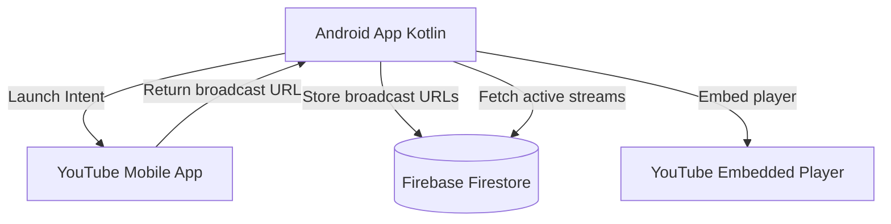
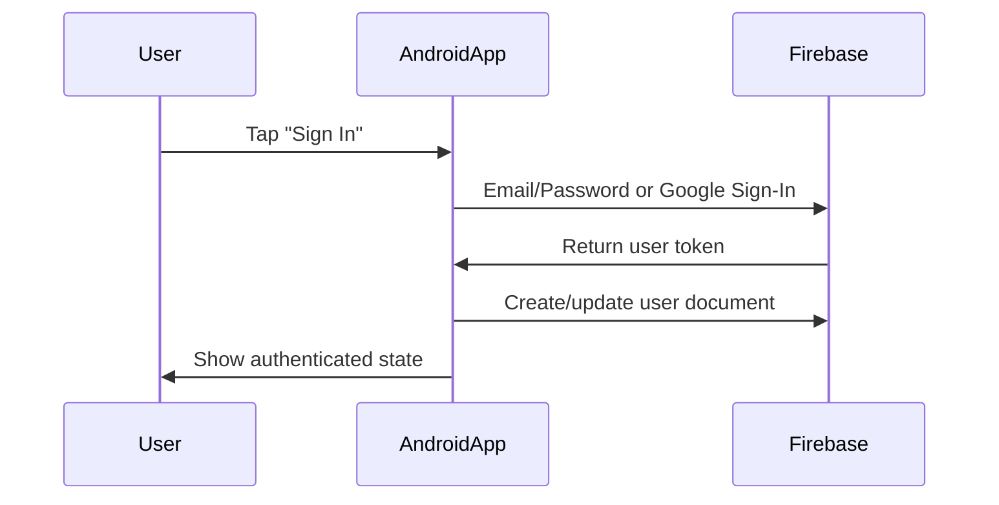
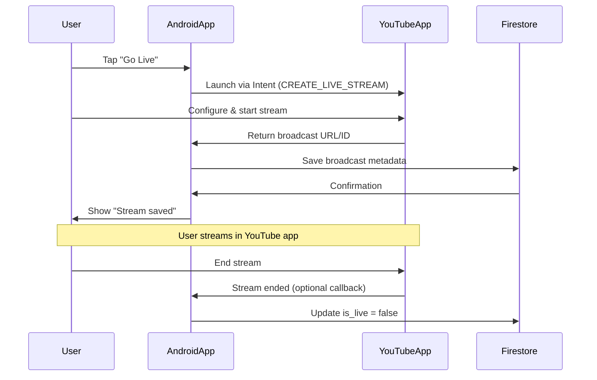
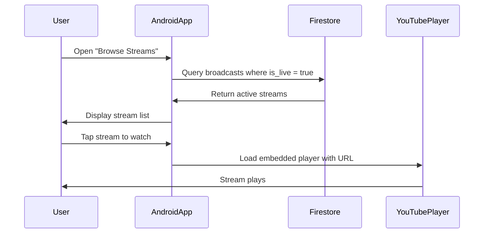

# YouTube Livestream Android POC - Simplified Architecture

## High-Level Architecture




## Components You Need to Spin Up

### 1. Firebase Project

**Purpose**: User authentication and broadcast metadata storage

**Setup Steps**:

1. Create Firebase project at console.firebase.google.com
2. Enable Firebase Authentication (Email/Password or Google Sign-In)
3. Enable Cloud Firestore database
4. Add Android app to Firebase project
5. Download `google-services.json` to app

**Firestore Schema**:

```
users/
  {userId}/
    username: string
    email: string
    youtube_channel_name: string (optional)
    created_at: timestamp

broadcasts/
  {broadcastId}/
    user_id: string
    username: string
    youtube_url: string (e.g., "https://youtube.com/watch?v=abc123")
    broadcast_id: string
    is_live: boolean
    started_at: timestamp
    ended_at: timestamp (nullable)
```

**Firestore Rules** (basic):

```javascript
rules_version = '2';
service cloud.firestore {
  match /databases/{database}/documents {
    match /users/{userId} {
      allow read: if true;
      allow write: if request.auth.uid == userId;
    }
    match /broadcasts/{broadcastId} {
      allow read: if true;
      allow create: if request.auth != null;
      allow update, delete: if request.auth.uid == resource.data.user_id;
    }
  }
}
```

### 2. Android App (Kotlin)

**Core Components**:

1. **Firebase Integration**
  - Authentication
  - Firestore SDK
2. **YouTube Intent Integration**
  - Launch YouTube livestream via Intent
  - Capture broadcast URL/ID from result
3. **YouTube Player**
  - Embed YouTube player for viewing
  - Display stream list

**Project Structure**:

```
app/
├── MainActivity.kt
├── ui/
│   ├── StreamListFragment.kt
│   ├── GoLiveActivity.kt
│   └── PlayerActivity.kt
├── data/
│   ├── FirestoreRepository.kt
│   └── models/
│       ├── User.kt
│       └── Broadcast.kt
└── utils/
    └── YouTubeIntentHelper.kt
```

**Dependencies** (build.gradle):

```kotlin
// Firebase
implementation("com.google.firebase:firebase-auth-ktx")
implementation("com.google.firebase:firebase-firestore-ktx")

// YouTube Player
implementation("com.pierfrancescosoffritti.androidyoutubeplayer:core:12.1.0")

// UI
implementation("androidx.compose.ui:ui")
implementation("androidx.lifecycle:lifecycle-viewmodel-compose")
```

**User Requirements**:

- Android 6.0+ (API 23)
- YouTube app installed (version 13.02+)
- YouTube channel with live streaming enabled
  - Requires 1000+ subscribers OR phone verification
  - This is a YouTube platform limitation

## Authentication Flow

**Simplified with Firebase Auth** (no YouTube OAuth needed for POC)




**Note**: No YouTube OAuth required because YouTube app handles streaming independently. App only stores broadcast URLs.

## Broadcast Flow (Android)

**Simplified Architecture** - YouTube app handles streaming:




**Code Implementation**:

```kotlin
// GoLiveActivity.kt
fun launchYouTubeLivestream() {
    val intent = Intent("com.google.android.youtube.intent.action.CREATE_LIVE_STREAM")
    intent.setPackage("com.google.android.youtube")
    
    if (intent.resolveActivity(packageManager) != null) {
        startActivityForResult(intent, REQUEST_CODE_YOUTUBE_LIVE)
    } else {
        // YouTube app not installed
        showInstallYouTubeDialog()
    }
}

override fun onActivityResult(requestCode: Int, resultCode: Int, data: Intent?) {
    if (requestCode == REQUEST_CODE_YOUTUBE_LIVE && resultCode == RESULT_OK) {
        val broadcastUrl = data?.getStringExtra("broadcast_url")
        val broadcastId = data?.getStringExtra("broadcast_id")
        
        // Save to Firestore
        saveBroadcastToFirestore(broadcastUrl, broadcastId)
    }
}
```

## Viewing Flow

**Simplified** - Direct Firestore queries:




**Code Implementation**:

```kotlin
// StreamListFragment.kt
fun fetchLiveStreams() {
    firestore.collection("broadcasts")
        .whereEqualTo("is_live", true)
        .orderBy("started_at", Query.Direction.DESCENDING)
        .addSnapshotListener { snapshot, error ->
            val streams = snapshot?.toObjects(Broadcast::class.java)
            updateUI(streams)
        }
}

// PlayerActivity.kt
fun playStream(youtubeUrl: String) {
    val videoId = extractVideoIdFromUrl(youtubeUrl)
    youtubePlayerView.initialize(object : YouTubePlayer.OnInitializedListener {
        override fun onInitializationSuccess(
            provider: YouTubePlayer.Provider,
            player: YouTubePlayer,
            wasRestored: Boolean
        ) {
            if (!wasRestored) {
                player.loadVideo(videoId)
            }
        }
    })
}
```

## Key Technical Requirements

### User Prerequisites

**Critical limitations** (YouTube platform restrictions):

1. **YouTube app installed** - Must have YouTube app version 13.02+
2. **YouTube channel** - User must have a YouTube channel
3. **Live streaming enabled** - Channel requires:
  - 1000+ subscribers, OR
  - Phone verification

**This is non-negotiable** - it's how YouTube controls livestream access.

### Device Requirements

- Android 6.0+ (API 23)
- Camera capable of 720p @ 30fps minimum
- Hardware H.264 encoder support
- Stable internet: 5+ Mbps upload for 720p

### Firebase Requirements

- Free tier supports up to:
  - 1 GB stored data
  - 10 GB/month bandwidth
  - 50,000 reads/day
  - 20,000 writes/day
- More than enough for POC with <1000 users

## Cost Considerations

**Completely Free for POC**:

- ✅ **Firebase**: Free tier more than sufficient
- ✅ **YouTube hosting**: Free (unlimited)
- ✅ **YouTube API**: Not needed (using Intent shortcut)
- ✅ **No backend**: No hosting costs

**Total infrastructure cost: $0/month**

Only costs would be:

- Google Play Store fee: $25 one-time (if publishing)
- Domain name: ~$12/year (optional)

## Pros/Cons of This Simplified Approach

**Pros**:

✅ **Extremely fast to build** - 5-7 days total
✅ **Zero infrastructure costs** - Firebase free tier
✅ **Zero backend complexity** - No server to maintain
✅ **Proven, reliable** - YouTube handles all video infrastructure
✅ **Built-in features** - Chat, analytics, VOD automatic
✅ **Scales infinitely** - YouTube CDN handles traffic
✅ **Production-ready** - Can launch with this architecture

**Cons**:

❌ **User friction** - Requires YouTube app + streaming-enabled channel
❌ **Limited control** - Can't customize stream settings
❌ **UX disruption** - Users leave app to stream
❌ **Platform dependency** - Subject to YouTube's terms
❌ **No programmatic control** - Can't manage broadcasts via code

## Build Timeline

**Day 1-2: Foundation**

- Firebase project setup
- Android app scaffold
- Firebase Auth integration

**Day 3-4: Core Features**

- YouTube Intent integration
- Firestore broadcast storage
- Stream list UI

**Day 5-6: Player & Polish**

- Embedded YouTube player
- UI/UX refinement
- Error handling

**Day 7: Testing**

- End-to-end flow testing
- Edge case handling

**Total: ~7 days** with one developer

## Implementation Details

### YouTube Intent Gotchas

**Important considerations**:

1. **Intent may not return data** - YouTube app behavior varies by version
  - Fallback: Let users manually paste YouTube URL
  - Alternative: Prompt user to copy broadcast URL and return to app
2. **No programmatic broadcast control**
  - Can't start/stop streams via code
  - User manages everything in YouTube app
  - Your app just stores/displays URLs
3. **YouTube app requirement**
  - Check if installed before launching Intent
  - Provide fallback to Play Store if missing

**Robust Intent handling**:

```kotlin
fun launchYouTubeLivestream() {
    val intent = Intent("com.google.android.youtube.intent.action.CREATE_LIVE_STREAM")
    intent.setPackage("com.google.android.youtube")
    
    when {
        intent.resolveActivity(packageManager) != null -> {
            startActivityForResult(intent, REQUEST_CODE_YOUTUBE_LIVE)
        }
        else -> {
            // Fallback: manual URL entry
            showManualUrlEntryDialog()
        }
    }
}
```

### Manual URL Entry (Recommended Fallback)

Since Intent behavior is unreliable, add manual entry flow:

```kotlin
fun showManualUrlEntryDialog() {
    AlertDialog.Builder(this)
        .setTitle("Enter YouTube Live URL")
        .setMessage("1. Open YouTube app\n2. Start livestream\n3. Copy URL\n4. Paste here")
        .setView(editTextView)
        .setPositiveButton("Save") { _, _ ->
            val url = editTextView.text.toString()
            saveBroadcastToFirestore(url)
        }
        .show()
}
```

### Detecting Stream End

**Challenge**: No reliable callback when user ends stream in YouTube app.

**Solutions**:

1. **Manual button** - Add "End Stream" button in your app that updates Firestore
2. **YouTube API polling** - Periodically check stream status (requires YouTube API setup)
3. **Time-based** - Auto-mark streams as ended after X hours
4. **Ignore it** - Keep streams marked as live, rely on YouTube player to show "Stream ended"

**Recommended for POC**: Option 1 (manual) or 4 (ignore).

### Firestore Queries

**Efficient queries for stream list**:

```kotlin
// Real-time listener for live streams
firestore.collection("broadcasts")
    .whereEqualTo("is_live", true)
    .orderBy("started_at", Query.Direction.DESCENDING)
    .limit(50)
    .addSnapshotListener { snapshot, _ ->
        val streams = snapshot?.toObjects(Broadcast::class.java)
        updateStreamList(streams)
    }
```

**Create compound index** in Firebase Console:

- Collection: `broadcasts`
- Fields: `is_live` (Ascending), `started_at` (Descending)

## Next Steps

1. **Set up Firebase project** → Get `google-services.json`
2. **Create Android project** in Android Studio
3. **Integrate Firebase Auth** → Test sign-in flow
4. **Test YouTube Intent** → Verify app behavior
5. **Build stream list UI** → Display dummy data first
6. **Connect Firestore** → Save/fetch real broadcasts
7. **Embed YouTube player** → Test playback
8. **Polish & test** → Handle edge cases

